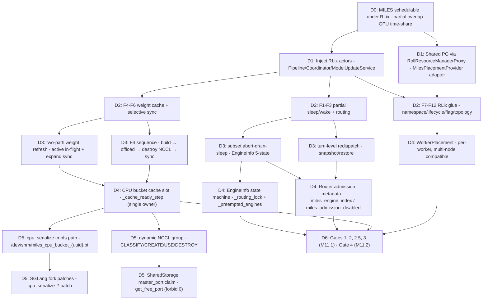
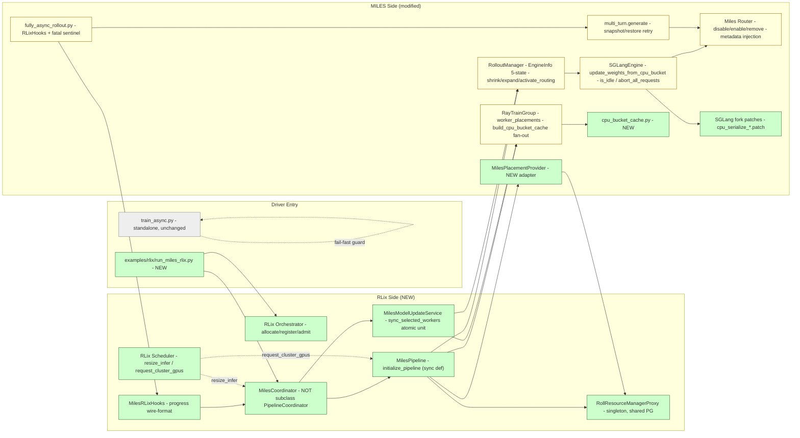
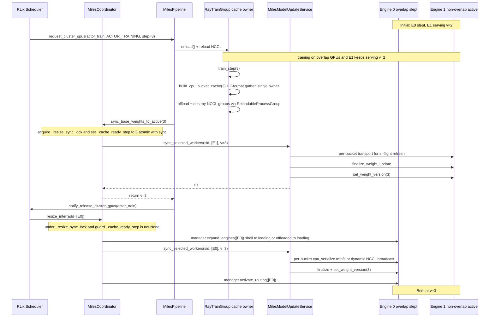

# Plan Viz

Feature: **MILES → RLix port (fullasync GRPO under partial overlap)**
Source: [plans/miles-port-unified-plan.md](../plans/miles-port-unified-plan.md)

## 0. Audit Dashboard

- **Goal**: make MILES fullasync GRPO schedulable by RLix; share GPUs across pipelines via partial overlap (`actor_train ⊂ actor_infer`).
- **Top architecture decision**: introduce `MilesPipeline` + `MilesCoordinator` + `MilesModelUpdateService` (RLix-side) + `MilesPlacementProvider` adapter; reuse `ReloadableProcessGroup` for NCCL teardown.
- **Main behavior change**: subset sleep/wake of SGLang engines; CPU bucket cache + selective sync (cpu_serialize colocate + dynamic NCCL broadcast non-colocate); turn-level redispatch on preempt.
- **Highest-risk decision**: F4/F5+6 atomic unit — `_cache_lock` + per-bucket barrier + dual-mask receivers + version label inversion under `_resize_sync_lock`.
- **Likely touched files**: `miles/ray/rollout.py`, `miles/backends/sglang_utils/sglang_engine.py`, `miles/router/router.py`, `miles/rollout/generate_hub/multi_turn.py`, `miles/ray/actor_group.py`, `examples/fully_async/fully_async_rollout.py`; new `rlix/pipeline/miles_{pipeline,coordinator,model_update_service,hooks}.py`, `miles/ray/placement_provider.py`, `examples/rlix/run_miles_rlix.py`.
- **Must-not-change behavior**: standalone (`DO_TIME_SHARING=False`) path of `train_async.py`; existing group-level recycle for tool-error aborts; existing `_send_to_colocated_engine` cuda_ipc standalone path.
- **User audit focus**: (1) F4 sequence correctness (build → offload → destroy NCCL → sync) and HF-format cache invariant; (2) F10 fail-fast gates (cpu_serialize on M11.1, contiguous mapping, `offload_train`, EP=1, no async_save); (3) M11.1 vs M11.2/M11.6 milestone scoping.

## 1. Decision Map

| Decision | Chosen | Depends On | Audit |
| -------- | ------ | ---------- | ----- |
| D0 Goal | partial overlap, subset sleep/wake, CPU bucket cache, selective sync | — | scope alignment |
| D1 Integration | RLix actors + shared PG adapter, no `RayVirtualCluster` | D0 | confirm `MilesPlacementProvider` is real adapter, not wrapper |
| D2 Boundary | 12 features split MILES↔RLix; one merged adapter for F7+F8+F11 | D1 | confirm namespace + reg lifecycle + flag remain independent capabilities |
| D3 Runtime | subset abort-drain-sleep; turn-level redispatch; two-path refresh | D2 | F4 sequence correctness; commit-after-success in multi_turn |
| D4 State | `EngineInfo` 5-state, router metadata, single cache slot | D3 | shell-state semantics; `_cache_ready_step` lock scope |
| D5 Details | cpu_serialize on M11.1 (vast.ai); dynamic NCCL group; tmpfs payload | D4 | tmpfs lifecycle owner; `master_port=0` forbidden |
| D6 Evidence | Gate 1/2/2.5/3 (M11.1); Gate 4 (M11.2); cuda_ipc gate (M11.6) | D3, D5 | Gate 2.5 covers dual-mask receiver + Megatron NCCL destroy/reload |

## 2. Critical Views

### 2.1 Architecture Integration View

**Rejected alternatives**:
- request-level deterministic migration (ROLL `RequestScheduler`) — replaced by turn-level redispatch.
- per-request tracking inside `RolloutManager` — replaced by SGLang `/v1/loads` idle bool.
- subclassing `PipelineCoordinator` — manually re-implement to avoid ROLL config validators.
- header-only preempt classification — replaced by JSON `meta_info` injection.

### 2.2 Runtime / Data Path View

**Invariants**:
- `_cache_ready_step` updated **inside** `_resize_sync_lock` and same atomic unit as `service.sync_selected_workers` — no stale-version inversion.
- F4 sequence: build cache (Step 4 of init) → offload (Step 5) → destroy NCCL → sync paths thereafter. Reordering (a) reads uninitialized weights, (b) deadlocks on gather, or (c) leaves engines on base weights.
- `service.sync_selected_workers` is the **atomic unit**: `(a) per-bucket transport + (b) finalize_weight_update fan-out + (c) set_weight_version` wrapped in single `ROLL_SELECTIVE_MODEL_UPDATE_TIMEOUT_S`.
- Pipeline never directly calls `finalize_weight_update` or manager-level `set_weight_version`.

**Error / fallback paths**:
- Receiver hang → timeout 150s → raise → coordinator → pipeline crash (fail-fast, no retry).
- Turn redispatch exhausted → `EnginePreemptedError` → fully_async fatal sentinel → pipeline crash (NOT silent group recycle).
- Router metadata missing in RLix mode → `RLixRouterMetadataError` → fatal sentinel.
- Init failure → `MilesPipeline.initialize_pipeline()` Phase 2 cleanup: `ray.kill` train actors → `RolloutManager.shutdown_hard` → release infer scheduler allocation → raise.

## 3. Audit Checkpoints

- [ ] D1: `MilesPlacementProvider` is a real adapter — accepts injected `RollResourceManagerProxy` and `train/infer_device_mapping` from the same source as `register_pipeline`.
- [ ] D3: F4 build/offload/destroy/sync order is enforced and the `_cache_lock` covers the full transport critical section (not just lookup or pointer swap).
- [ ] D3: `multi_turn.py` snapshot-then-retry truncates `tokens / weight_versions / loss_mask / spec_info / prefix_cache_info` correctly; commit point stays after generation success.
- [ ] D4: `EngineInfo.state ∈ {shell, active, disabling, offloaded, loading}` is the source of truth; `_preempted_engines` is a preempt-attribution window, not a redundant cache.
- [ ] D4: Router `_use_url` actually filters by `enabled_workers - dead_workers` (admission state must influence dispatch, not only metadata).
- [ ] D5: cpu_serialize wrapper owns tmpfs cleanup (`try/finally os.unlink`); HTTP route is synchronous and does not retain `payload_path`.
- [ ] D5: NCCL `master_port` chosen via `get_free_port()` + SharedStorage claim; `master_port=0` forbidden.
- [ ] D6: Gate 2.5 exercises mixed receiver mask (`cpu_serialize_local_ranks` + `broadcast_local_ranks`) and `is_group_exist` no-op guard; Gate 3 verifies `ROLL_SELECTIVE_MODEL_UPDATE_TIMEOUT_S` triggers crash.

## Appendix A: Full Decision Trace

| Decision | Layer | Chosen | Rejected | Depends On | Unlocks | User Audit |
| -------- | ----- | ------ | -------- | ---------- | ------- | ---------- |
| D0 Goal | D0 | partial overlap GPU time-sharing across pipelines | tp=1 MVP; standalone-only | — | all features | scope freeze |
| D1.A RLix actor injection | D1 | new `MilesPipeline` / `MilesCoordinator` / `MilesModelUpdateService` | subclass `PipelineCoordinator`; reuse ROLL `FullFinetunePipeline` directly | D0 | F5+6, F7-F11 | confirm no super().__init__ to ROLL coordinator |
| D1.B Shared PG | D1 | `MilesPlacementProvider` real adapter on shared `RollResourceManagerProxy` | self-built PG; `RayVirtualCluster`-style cluster wrapper | D0 | F12 | adapter materializes ROLL `List[List[Dict]]` to `WorkerPlacement` |
| D2.A Sleep/wake/route module | D2 | F1+F2+F3 owned by `RolloutManager` + Miles Router | per-engine self-managed sleep | D1.A | F5+6 | engine_index dispatch single dim (TP fan-out internal) |
| D2.B Cache + sync module | D2 | F4+F5+F6 owned by service; cache owner = `_is_distributed_src_rank` | dual cache slots; ROLL versioning | D1.A | D3.D | single slot; lock covers full transport |
| D2.C RLix glue | D2 | F7-F12 (one `MilesRLixAdapter` allowed but capabilities preserved) | merge namespace+lifecycle+flag into one capability | D1.A, D1.B | D6 | namespace isolation + reg lifecycle + DO_TIME_SHARING all preserved |
| D3.A Subset abort-drain-sleep | D3 | admission-close → abort → drain via `/v1/loads` → release_memory_occupation | per-request id tracking | D2.A | F1, F2 | drain reads `slot["num_total_reqs"]`, NOT `/server_info` |
| D3.B Turn-level redispatch | D3 | snapshot → retry, fail-fast on exhaustion | request-level deterministic migration; reset_for_retry | D2.A | F3 | commit point post-success; MAX_ATTEMPTS = total_engine_count |
| D3.C Two-path refresh | D3 | active in-flight (no drain) + expand sync; same atomic unit | drain-then-sync; per-engine finalize hook | D2.B | F5+6 | active refresh tolerated bounded mis-attribution |
| D3.D F4 sequence | D3 | build → offload → destroy NCCL → sync | build after offload; sync before offload | D2.B | F4 | reordering deadlocks gather |
| D4.A EngineInfo | D4 | 5-state dataclass single dict | 5 parallel maps; bool flag for `is_engine_resident_on_gpu` | D3.A | F2 | shell semantics for M11.2 partial allocation |
| D4.B Router metadata | D4 | mutate JSON body in `do_proxy` (path == "generate") + admission state | header-only; SSE streaming | D3.A, D3.B | F3 | Content-Encoding stripped; payload re-serialized |
| D4.C Cache slot + version | D4 | single cache, `_cache_ready_step` updated inside `_resize_sync_lock` | ROLL double-buffer; version bump per sync | D3.D | F4, F5+6 | sync_base_weights_to_active explicitly accepts step |
| D4.D WorkerPlacement | D4 | per-worker, node-local gpu_ids, multi-node compatible | global GPU id assumption; cluster wrapper | D1.B | F12 | `base_gpu_id=0` (post-CVD local) |
| D5.A cpu_serialize tmpfs | D5 | `/dev/shm/miles_cpu_bucket_{uuid}.pt` + HTTP path | base64 in HTTP body; ObjectRef ID via subprocess `ray.init` | D4.C | F4 (M11.1) | wrapper-owned cleanup |
| D5.B Dynamic NCCL group | D5 | per-sync CLASSIFY/CREATE/USE/DESTROY + warmup allreduce | persistent group; group reuse | D4.C | F4 (non-colocate) | per-bucket barrier before staging free |
| D5.C master_port via SharedStorage | D5 | `get_free_port()` + SharedStorage claim | `master_port=0`; static config | D5.B | NCCL group | port 0 breaks multi-rank rendezvous |
| D5.D SGLang fork patches | D5 | 4 patches under `external/sglang/3rdparty/cpu_serialize/` | upstream PR; vendored fork only | D5.A | F4 receiver | rebase per SGLang bump |
| D6 Gates | D6 | Gate 1/2/2.5/3 M11.1; Gate 4 M11.2; cuda_ipc M11.6 | tp=1 MVP gate | D3, D5 | M11.1 sign-off | Gate 2.5 covers dual-mask `tp>1` |

## Appendix B: Full Module / File Boundary

| File / Module | Role | Allowed Change | Forbidden Responsibility | Parent Decision |
| ------------- | ---- | -------------- | ------------------------ | --------------- |
| [miles/ray/rollout.py](../external/miles/miles/ray/rollout.py) | RolloutManager + EngineInfo + routing lock | add `EngineInfo`, `shrink/expand_engines`, `activate_routing`, `set_weight_version`, subset APIs | direct `service.X.remote` calls; per-request id tracking | D2.A, D4.A |
| [miles/backends/sglang_utils/sglang_engine.py](../external/miles/miles/backends/sglang_utils/sglang_engine.py) | SGLang Ray actor wrapper | add `update_weights_from_cpu_bucket`, `is_idle`, `abort_all_requests`, post-sleep VRAM assertion (server-side) | reading `torch.cuda.memory_allocated()` from actor process; `os.environ["CUDA_VISIBLE_DEVICES"] = ...` after import | D2.A, D5.D |
| [miles/router/router.py](../external/miles/miles/router/router.py) | Miles Router admission state | add disable/enable/remove + metadata injection (path=="generate") | mutate non-/generate endpoints; gzip-encoded body injection (must skip + RLix fail-fast) | D4.B |
| [miles/rollout/generate_hub/multi_turn.py](../external/miles/miles/rollout/generate_hub/multi_turn.py) | Multi-turn trajectory generator | snapshot-then-retry; force `stream=False`; classify preempt | swallow `EnginePreemptedError`; fall back to group recycle on exhaustion | D3.B |
| [miles/rollout/base_types.py](../external/miles/miles/rollout/base_types.py) | Shared types | add `EnginePreemptedError`, `RLixRouterMetadataError` | extending `GenerateFnInput` schema | D3.B |
| [miles/ray/actor_group.py](../external/miles/miles/ray/actor_group.py) | RayTrainGroup | add `worker_placements` path, `build_cpu_bucket_cache` fan-out, `collect_cache_owner_roles`, self-cleanup | sharing actor handles across pipelines (namespace must isolate) | D1.B, D2.B |
| miles/ray/placement_provider.py (NEW) | ROLL ↔ MILES placement adapter | construct `WorkerPlacement` from injected proxy + injected mappings | self-instantiating `RollResourceManagerProxy`; deriving `device_mapping` via `list(range(...))` | D1.B, D4.D |
| [miles/utils/arguments.py](../external/miles/miles/utils/arguments.py) | CLI args | add `miles_model_update_bucket_size_mb`, `miles_post_sleep_vram_threshold_gb`, `model_update_transport` | adding `device_mapping` args (derive only) | D5 |
| [examples/fully_async/fully_async_rollout.py](../external/miles/examples/fully_async/fully_async_rollout.py) | fully_async outer loop | accept `rlix_hooks`; add fatal sentinel on (`EnginePreemptedError`, `RLixRouterMetadataError`) | importing RLix wire types; calling `ray.get_actor("rlix:coordinator:...")`; reading `worker.buffer` | D3.C, D6 |
| [train_async.py](../external/miles/train_async.py) | Standalone entry | add fail-fast guard (RLIX_CONTROL_PLANE → raise; partial overlap topology → raise) | branching RLix behavior inside; importing RLix actors | D2.C |
| examples/rlix/run_miles_rlix.py (NEW) | RLix entry | orchestrator + coordinator + pipeline.initialize_pipeline + main loop | top-level try/except + ray.shutdown (fail = raise propagate; user `ray stop`) | D2.C |
| miles/utils/rlix_hooks.py (NEW) | `RLixHooks` protocol + `NoOpRLixHooks` | import seam | importing RLix types | D2.C |
| rlix/pipeline/miles_pipeline.py (NEW) | RLix-side `MilesPipeline` actor | sync `initialize_pipeline` (`run(coro)`), train/infer cluster lifecycle, F10 validation | `async def initialize_pipeline`; mixing sync `_request_cluster_gpus` with asyncio.Lock | D1.A, D2.C |
| rlix/pipeline/miles_coordinator.py (NEW) | `MilesCoordinator` (manual init, NOT subclass) | `bootstrap_active_engines`, `publish_cache_ready_step`, `register_model_update_resources`, `sync_base_weights_to_active(step)`, `resize_infer / _expand_workers` | `super().__init__()` to `PipelineCoordinator` (triggers ROLL config validators) | D1.A, D2.B |
| rlix/pipeline/miles_model_update_service.py (NEW) | sync atomic unit | per-bucket transport + finalize fan-out + set_weight_version, all in one timeout | leak ObjectRef beyond sync barrier; persistent NCCL group across syncs | D2.B, D5.A, D5.B |
| rlix/pipeline/miles_hooks.py (NEW) | `MilesRLixHooks` real impl | wire-format packing for `ProgressReport` | reading MILES internals | D2.C, F9 |
| external/sglang/3rdparty/cpu_serialize/*.patch (NEW) | SGLang fork patches | new HTTP route, scheduler dispatch, in-process load | extending existing `update_weights_from_tensor` transport field | D5.D |
| [miles/router/middleware_hub/radix_tree_middleware.py](../external/miles/miles/router/middleware_hub/radix_tree_middleware.py) | radix tree middleware | none in M11.1 (RLix mode forbids loading) | making it pass-through; partial_rollout + radix_tree compat | D2.A |
| [miles/utils/reloadable_process_group.py](../external/miles/miles/utils/reloadable_process_group.py) | NCCL teardown | none (already in place) | reimplementing NeMo-style `nccl_offload.py` | D3.D |

## Appendix C: Full Risk → Evidence Matrix

| Decision | Risk | Required Evidence | Stop Condition |
| -------- | ---- | ----------------- | -------------- |
| D3.D F4 sequence | gather deadlock or empty cache if order wrong | Gate 2.5 multi-step destroy/reload cycle; assertion `cache_ready_step != None` before expand | hang or `_cache_ready_step is None` raise |
| D3.C Active refresh | request-level mis-attribution window beyond bounded in-flight | Gate 3 quantifies mis-attribution count; `_current_weight_version` published at engine after barrier | mis-attribution exceeds in-flight × decode-step bound |
| D3.B Turn redispatch | retry exhaustion in valid topology = scheduler/admission bug | Gate 1 multi-turn preempt resumes from aborted turn (env state preserved); Gate 3 verifies `MAX_TURN_REDISPATCH_ATTEMPTS = total_engine_count` | exhaustion in M11.1 4-GPU topology |
| D4.A EngineInfo states | shell→loading lazy ctor leaks Ray actor on failure | Gate 4 (M11.2) Pipeline B partial allocation; M4 self-cleanup unit test | actor handle leak after init failure |
| D4.B Router metadata | gzip-encoded body or non-JSON skip silently in RLix mode | unit test: route stripping `Content-Encoding`; integration test: missing `miles_admission_disabled` raises `RLixRouterMetadataError` | router upgrade incomplete in production |
| D4.C `_cache_ready_step` | stale label inversion if not under `_resize_sync_lock` with sync | Gate 3 concurrent expand + after_training; assert receiver sees new label after refresh | label < step after publish |
| D5.A tmpfs lifecycle | leak on crash mid-sync; concurrent receiver overflows /dev/shm | unit test: `try/finally os.unlink` covers HTTP error path; F10 startup `shutil.disk_usage` check | `/dev/shm` ENOSPC during sync |
| D5.B Dynamic NCCL group | port collision; group survival across syncs | Gate 2.5 warmup allreduce; SharedStorage claim; group destroy verified before next sync | `init_collective_group` raise EADDRINUSE persistently |
| D5.C master_port=0 forbidden | rendezvous failure on multi-rank | F10 fail-fast assertion | scheduler returns port=0 |
| F10 topology | silent OOM if user runs partial overlap without RLix mode | `train_async.py` fail-fast guard `train_devices_subset_of_infer` | unguarded standalone run with overlap topology |
| F10 transport | cuda_ipc on vast.ai (no CAP_SYS_PTRACE / `--ipc=host`) | M11.1 fail-fast `model_update_transport == "cpu_serialize"`; M11.6 smoke-test capability check | starts on restricted container with cuda_ipc |
| F10 async_save | torch_memory_saver.pause() vs flush race → segfault | F10 `assert not args.async_save` | flag enabled in RLix mode |
| F10 EP/MoE | F4 cache covers dense only | `assert expert_model_parallel_size == 1` and `moe_router_topk == 0` | EP > 1 enabled |
| F10 cross-node rollout engine | `WorkerPlacement.placement_group` is per-node | `assert rollout_num_gpus_per_engine <= num_gpus_per_node` | engine TP/EP straddles nodes |
| F12 cleanup | scheduler/Ray ledger split → next pipeline OOM | M4 hard cleanup on failure path; release_cluster_gpus gated on `actor_infer_allocated` | scheduler shows free GPU but Ray actor still holds CUDA context |

## Appendix D: Implementation Detail Trace

| Implementation Detail | Parent Decision | Reason | Drift Risk |
| --------------------- | --------------- | ------ | ---------- |
| `_routing_lock = asyncio.Lock` (manager-local, not actor-distributed) | D4.A | dispatch + state transition is short critical section; abort/drain/sleep run outside lock | Medium — must NOT reuse `RolloutManager.rollout_engine_lock` (cross-process distributed lock) |
| `_preempted_engines` retained across `disabling→offloaded→loading→active` | D4.A | preempt attribution outlives `EngineInfo.state` window | Medium — clearing too early reverts to ambiguous abort classification |
| `MAX_TURN_REDISPATCH_ATTEMPTS = args.rollout_num_gpus // args.rollout_num_gpus_per_engine` | D3.B | use total engines (incl. sleeping); using `active_engine_count` collapses to 1 in shrink-to-1 cases | High — earlier draft used active count |
| `payload_bytes` parameter is auto-derefed `bytes`, not `ObjectRef` | D5.A | Ray runtime auto-derefs top-level ObjectRef at method boundary | High — calling `ray.get(payload_bytes)` raises TypeError |
| `do_proxy` JSON mutation guarded by `path == "generate"` | D4.B | other endpoints (`/model_info`, `/v1/loads`, `/health`) must keep schema | Medium — over-broad guard breaks healthchecks |
| Strip `Content-Encoding` after body mutation | D4.B | upstream may gzip; modified body must not carry stale encoding header | Medium — easy to forget on patch update |
| `master_port` selected via `get_free_port()` then claimed via SharedStorage | D5.C | `master_port=0` cannot rendezvous multi-rank; ephemeral OS bind only known to rank 0 | High — looks fine on single-rank tests |
| `RayTrainGroup` `num_gpus_per_actor=0.01` in RLix mode | D1.B | offloaded train must release scheduler view of GPU; standalone uses 0.4 | Medium — leaving 0.4 deadlocks Gate 4 |
| `base_gpu_id=0` for SGLang in RLix mode (not `wp.gpu_ids[0]`) | D4.D | post-CVD local view; physical id breaks SGLang `physical_gpu_id ∈ CVD list` validation | High — looks "more explicit" but is wrong |
| `coordinator.publish_cache_ready_step(-1)` only at init bootstrap | D4.C | active refresh path now updates `_cache_ready_step` inside `_resize_sync_lock`; init bootstrap is the only place a Pipeline B can be expanded before its first `after_training` | High — calling it again on each step risks lock-free inversion |
| `runtime_env={'env_vars': {'CUDA_VISIBLE_DEVICES': ...}}` at actor option time | D5.D | `cuInit()` lock timing: setting env after `import sglang/torch` is too late | High — actor body `os.environ[...] = ...` is a common shortcut |
| F9 progress unit = `group`, not `trajectory` | F9 | `len(data) < target_data_size` measures groups; trajectory-unit reports under-count by `n_samples_per_prompt` → premature shrink | Medium |
| F9 `_local_completed = initial_completed` (not derived from worker buffer scan) | F9 | `AsyncRolloutWorker` exposes `output_queue` + `get_completed_groups()` only; `worker.buffer` etc. are fake | Low — bucket-0 emit cost < scan invariants |
| `_FatalError` is sentinel class, NOT `Exception` subclass | F3 | otherwise outer try/except may swallow it | Medium |
| MilesCoordinator does not call `super().__init__` | D2.C | avoids ROLL `_validate_config_schema` / `_validate_offload_nccl` triggers on MILES args lacking those fields | High — easy to "just inherit" |
| `sync_lora_weights` ABC stub raises | D2.C | Coordinator ABC requires it; LoRA out of M11.1 scope | Low |
| Tmpfs file naming `miles_cpu_bucket_{uuid}.pt` | D5.A | grep-friendly leak detection (`ls /dev/shm/miles_cpu_bucket_*`) | Low |
| Per-bucket receiver invocation is **serial**, not parallel | D5.A | tmpfs peak = 1× bucket_size, not N× | Medium — parallelism looks like a perf win but breaks tmpfs budget |

## Appendix E: Execution Anchors

**Allowed Changes**:
- Add new files listed in the file-change table (`miles/ray/placement_provider.py`, `miles/utils/rlix_hooks.py`, `miles/backends/megatron_utils/update_weight/cpu_bucket_cache.py`, `examples/rlix/run_miles_rlix.py`, `rlix/pipeline/miles_*.py`, SGLang patches under `external/sglang/3rdparty/cpu_serialize/`).
- Modify the listed MILES files within the responsibilities documented in Appendix B.
- Add the listed RLix-mode args (`miles_model_update_bucket_size_mb`, `miles_post_sleep_vram_threshold_gb`, `model_update_transport`).
- Reuse `ReloadableProcessGroup` (no new NCCL teardown helper).

**Forbidden Changes**:
- Subclassing `PipelineCoordinator` (must hand-implement `MilesCoordinator`).
- Implementing cuda_ipc colocate path in M11.1 (it's M11.6).
- Re-introducing `partial_rollout + radix_tree` compatibility in M11.1.
- Extending `GenerateFnInput` schema (router metadata replaces it).
- Adding `device_mapping` CLI args (everything derives from existing `actor_num_nodes / actor_num_gpus_per_node / rollout_num_gpus`).
- Reading `torch.cuda.memory_allocated()` from the SGLang actor process (must read SGLang `/server_info` `memory_usage`).
- Using `master_port=0`, `os.environ["CUDA_VISIBLE_DEVICES"] = ...` post-import, or `super().__init__` chains to ROLL validators.
- Adding driver top-level `try/except + ray.shutdown` (failure = raise propagate; user `ray stop`).
- Replacing turn-level redispatch with group-recycle fallback when retry exhausts.

**Stop and ask the user if**:
- The implementation needs to touch files outside Appendix B.
- A lower-level decision (transport, lock scope, cleanup ownership) lacks a parent decision in the plan.
- A required test forces changing standalone (`DO_TIME_SHARING=False`) behavior.
- The architecture insertion point (e.g. `MilesPlacementProvider` injection site) appears wrong after reading the code.
- M11.1 scope must shift (e.g. cuda_ipc needed earlier, or M11.2 Gate 4 features pulled in).
- A receiver crash, port pool exhaustion, or graceful drain requirement appears in production before M11.5.
- MoE / EP / LoRA / cross-node rollout-engine support is requested.
- Public API compatibility (e.g. `RolloutManager.__init__` standalone three-tuple path) must be broken.

**Done Criteria (M11.1)**:
- Gate 1 passes (subset sleep/wake + routing on tp=2).
- Gate 2 passes (TP shrink-to-zero forbidden).
- Gate 2.5 passes (cpu_serialize colocate + dynamic NCCL broadcast non-colocate + dual-mask receivers + ReloadableProcessGroup destroy/reload cycle, ≥3 steps).
- Gate 3 passes (single-pipeline fullasync GRPO end-to-end with active refresh + expand sync + version monotonic + multi-turn preempt resume + staleness control).
- F10 fail-fast asserts cover all M11.1 must-haves (cpu_serialize, contiguous mapping, offload_train, EP=1, no async_save, single updateable model, sglang_dp=1, no PD).
