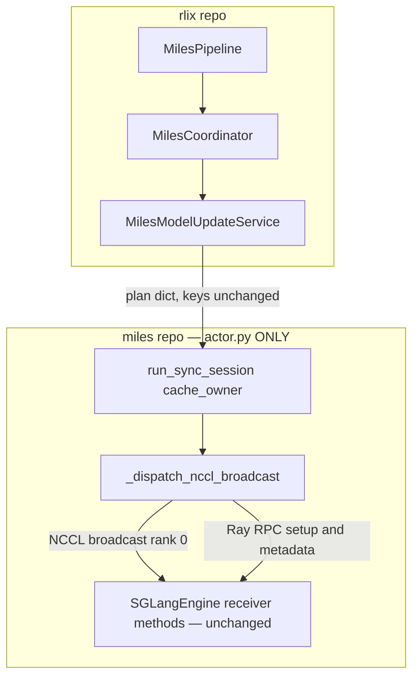
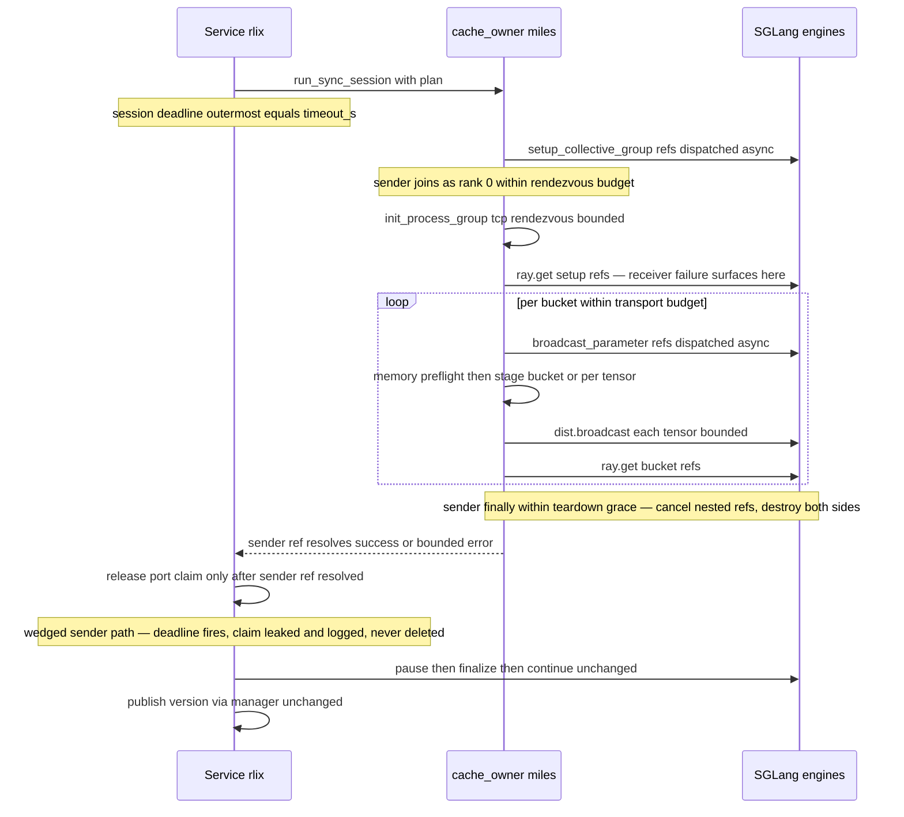
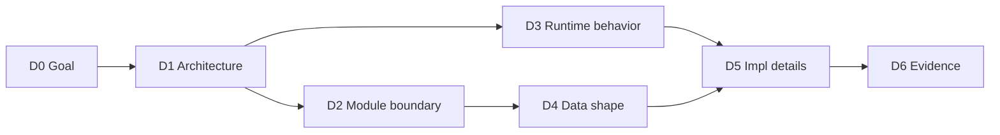

# TLDR — Enable NCCL broadcast path for miles weight update (rlops/rlix#42)

Source plan: `plans/miles-nccl-broadcast-plan.md` (DRAFT v8, 2026-08-16 — implementation in progress)
TLDR mode: `complex` (multi-repo, multi-actor runtime topology, 4 milestones)

## 0. Audit Dashboard

- **Goal**: unblock the NCCL broadcast transport for miles RLix-mode weight sync (issue #42), as a **user-selected mode** — `RLIX_MILES_UPDATE_TRANSPORT ∈ {cpu_serialize (default) | broadcast | auto}`; only `auto` ever mixes transports.
- **Blast radius (v6, minimal-change)**: miles = `actor.py` + tests ONLY; rlix = `miles_model_update_service.py` + `miles_coordinator.py` + `miles_pipeline.py` + one env-parameterization line in `run_smoke_dual.sh`.
- **Protocol change**: none on the wire — plan-dict keys unchanged; `comm_ranks`/`world_size` semantics refined per-GPU (C8); per-engine GPU count derived rlix-side from args (no new miles surface).
- **Highest-risk areas**: NCCL rendezvous failure semantics (R1/E7), deadline hierarchy + port-claim ownership (C6), rank accounting (C8/R2), staging OOM under mem 0.8 (R3/E8).
- **Review state**: codex rounds 1-5 (r4: approve on v5; r5 on v6: 1 high — uniformity assumed-not-enforced, fixed in v7 by a rlix-side startup uniformity guard) — pending codex round 6.
- **Milestones**: M1 miles sender → M2 rlix service → M3 rlix mode wiring → M4 e2e (overlap+`auto`+mem 0.8, plus strict-mode rejection check; all-broadcast positive e2e O7-deferred — miles C1 gate requires train ⊂ infer, v8).
- **Open `unknown`s**: 1 — warmup collective after group create (D5). See Appendix G.
- **Stop conditions**: 4 (S1-S4) — see Appendix E.
- **Artifact integrity**: AC-grid PASS (check_tldr_integrity.py exit 0); Mermaid PASS (validate_mermaid.sh exit 0).

## 1. Context

**Current**: RLix-mode weight sync chain (`MilesCoordinator` → `MilesModelUpdateService` → cache_owner `run_sync_session` → SGLang engines) fully works for Path A (cpu_serialize tmpfs+HTTP). Path B (NCCL broadcast) is scaffolded on both sides — plan fields, receiver-side fan-out code, SGLang receiver methods all exist — but is dead code behind two deliberate fail-fast guards (rlix `miles_model_update_service.py:199`, miles `actor.py:968`).

**Gap**: sender-side NCCL on the cache_owner (join dynamic group as rank 0, per-bucket `dist.broadcast`, teardown) was never implemented; without it receivers would hang in SGLang `/init_weights_update_group`. No rlix call site computes `broadcast_local_ranks`; rank accounting is per-engine (wrong for TP>1).

**v6 design stance (user-directed)**: transport is explicit user choice, not silent auto-classification. `broadcast` mode never mixes — it fail-fast-rejects topologies it cannot serve. The physics forcing a mixing mode to exist at all: NCCL cannot form a group containing the same physical GPU twice, so an engine sharing the cache_owner's GPU can never receive via broadcast — overlap topologies therefore require `auto` (mix) or `cpu_serialize`.

**Proven reference**: miles standalone `UpdateWeightFromDistributed` (pristine upstream — pattern reuse only, no modification).

## 2. Assumptions

| ID | Assumption |
|----|-----------|
| A1 | SGLang receiver routes behave per the standalone path: `/init_weights_update_group` registers `tp_size` consecutive NCCL ranks from `rank_offset`; `/update_weights_from_distributed` blocks until tensors arrive from rank 0 |
| A2 | `bucket.params` dict is insertion-ordered → metadata lists and sender broadcast order agree by construction |
| A3 | cache_owner has a live CUDA context; staging memory is preflight-checked per bucket with tensor-by-tensor degradation; miles S2 startup gate provides the config-level check |
| A4 | MVP validation is single-node, `nodes_per_engine == 1`; multi-node engine shards out of scope |
| A5 | `cluster_device_mappings` + `rollout_num_gpus_per_engine` suffice to derive engine ↔ physical-GPU sets (precedent: `MilesPipeline._wait_for_overlap_engines_offloaded`); the C9 startup assertion verifies derived classification against actual harness envs AND actual scheduler grant |
| A6 | Reviewer-history risk focus: NCCL rendezvous deadlock + global-vs-local rank confusion (PR rlops/RL#3 review classes) |

## 3. Scope & Constraints

### 3.1 Out of Scope

| ID | Excluded | Note |
|----|----------|------|
| O1 | Multi-node engines / cross-node validation | rank-cursor designed multi-node-ready, not e2e-verified here |
| O2 | Performance benchmarking cpu_serialize vs broadcast | issue asks capability, not perf |
| O3 | miles standalone update paths (`UpdateWeightFromDistributed`, `UpdateWeightP2P`, colocate IPC) | pristine upstream (C1) |
| O4 | LoRA / multi-adapter sync over broadcast | — |
| O5 | Mid-training re-classification beyond existing per-sync call sites | — |
| O6 | Heterogeneous per-engine GPU counts (prefill/decode TP mixes) | ENFORCED out of scope (v7): rlix startup uniformity guard fail-fasts server-group `num_gpus_per_engine` overrides diverging from `rollout_num_gpus_per_engine` (E10); future extension = miles `engine_gpu_counts` manager method |
| O7 | Fully-disjoint train/infer topologies + all-broadcast positive e2e (v8) | miles `assert_rlix_topology` C1 requires train ⊂ infer (M11 partial-overlap contract); admitting disjoint pools is a scheduler/validation design change, not a transport change |

### 3.2 Hard Constraints

| ID | Constraint |
|----|-----------|
| C1 | v6 tightened: miles changes = `actor.py` (`_dispatch_nccl_broadcast` + in-method helpers, all RLix-port-added) + tests, NOTHING else — no `rollout.py`, `arguments.py`, `rlix_validation.py` (C11/S2 untouched), `sglang_engine.py`, or any pristine upstream line |
| C2 | F04: single composite `run_sync_session` RPC; no new top-level Ray transport methods on train actor |
| C3 | F26/C16: `master_port != 0`, claimed via SharedStorage (existing, keep) |
| C4 | F21: exactly one `set_weight_version` publish per sync, service-only (unchanged) |
| C5 | Fail-fast + v6 no-silent-mode-switching: user-selected transport mode honored exactly or run refuses to start (strict `broadcast` + colocate target = startup rejection, never a quiet downgrade to mixing) |
| C6 | Enforcement split + nested deadline hierarchy (v8-r1): session deadline = `timeout_s` outermost; rendezvous budget (0.15×) doubles as the NCCL pg timeout bounding EACH collective (watchdog); cumulative monotonic deadline (rendezvous+transport=0.65×) checked between collectives; receiver acks get the remaining window; worst-case unwind = 0.9× session. Port claim: release only after sender teardown ack; sender-resolution tracked separately so post-resolution cancellation releases (no false leak); truly-wedged sender + broadcast → leak-and-log; cpu_serialize-only keeps release-on-timeout |
| C7 | No commit/push without explicit user instruction; codex approval before sign-off |
| C8 | NCCL ranks are per-GPU not per-engine: `world_size = 1 + per_engine × len(broadcast_set)`; rank_offset cursor per engine (uniform stride, O6) |
| C9 | M4 run (a) = dual overlap topology from harness defaults (`run_smoke_dual.sh:68-71`): P1 train [0] / infer [0,1,2]; P2 train [3] / infer [1,2,3]; mem fraction via `${MILES_SMOKE_MEM_FRACTION:-0.30}` parameterization, exported `0.8`, effective value echoed (0.30 run ≠ AC6); mode `auto`; startup assertion (env mappings + scheduler grant logged, ≥1 engine of each class per pipeline) — failure/divergence = smoke INVALID |

### 3.3 Acceptance Criteria

| ID | Statement | Derives from | Verified by | Milestone |
|----|-----------|--------------|-------------|-----------|
| AC1 | miles `run_sync_session` executes a plan with non-empty `broadcast_local_ranks` end-to-end (sender join + per-bucket broadcast with memory preflight + teardown), no `NotImplementedError` | Goal, A1, A2 | E1, E8 | M1 |
| AC2 | All-cpu_serialize behavior unchanged — default mode IS cpu_serialize (zero change until opt-in); existing unit tests pass unmodified; dual-run cpu_serialize legs + existing dual-smoke pass-bar green | Goal, C5 | E3, E5 | M4 |
| AC3 | Rank/world_size accounting correct for TP>1 (per-GPU cursor, uniform stride from args), unit-verified | C8, A1 | E2 | M2 |
| AC4 | Transport is user-selected via `RLIX_MILES_UPDATE_TRANSPORT` (cpu_serialize default / broadcast strict / auto) with startup-validated topology inputs: the v7 uniformity guard rejects resolved SGLang configs diverging from `rollout_num_gpus_per_engine` before classification; strict mode fail-fast-rejects colocate targets (NCCL duplicate-GPU constraint); `auto` is the only mixing mode; mode logged; invalid value errors | Goal, A5, C5 | E3, E10 | M3 |
| AC5 | Abnormal session end (receiver dies/rejects/hangs, mid-bucket exception, sender budget expiry) unwinds inside the C6 hierarchy with sender-owned teardown; port claim released strictly after teardown ack; wedged-sender residual path leaks-and-logs the claim | C6, C3 | E6, E7 | M2 |
| AC6 | Overlap e2e (C9, mode `auto`, mem 0.8 echoed): mixed-transport sessions per pipeline, startup assertion passes, zero GPU OOM, existing dual pass-bar met, EXIT_CODE=0 | Goal, A4, A5, C9 | E4 | M4 |
| AC7 | (v8 narrowed) Strict `broadcast` honors no-mix: E3 unit matrix (rejection naming colocate engines; all-disjoint + colocate-avoiding subset targets pass) + e2e rejection check on the overlap harness (mode=broadcast → classification fail-fast, log captured); all-broadcast positive e2e O7-deferred (miles C1 gate: train ⊂ infer) | Goal, A4, A5, C5 | E9 | M4 |

### 3.4 Milestones

| ID | Scope | Exit criteria | Delivers AC | Depends on |
|----|-------|---------------|-------------|------------|
| M1 | miles sender-side NCCL in `actor.py`: budget-bounded join + per-bucket broadcast with memory preflight + sender-owned teardown + guard removal | E1, E7, E8 green | AC1 | — |
| M2 | rlix service unlock + per-GPU rank cursor (uniform stride from args, no manager RPC) + C6 claim/deadline rules + unit tests | E2, E6 green | AC3, AC5 | M1 |
| M3 | rlix transport-mode wiring: env resolution (3 modes, default cpu_serialize), v7 uniformity startup guard, strict-mode rejection, auto classification, both call sites + unit tests | E3, E10 green | AC4 | M2 |
| M4 | vast.ai e2e (v8): (a) overlap + `auto` + mem 0.8; (b') strict-mode rejection check on the same overlap harness (fast, no training) | E4, E5, E9 green | AC2, AC6, AC7 | M3 |

### 3.5 Strategy notes

- v6 control model: ONE rlix-side env selects transport; default `cpu_serialize` = today's behavior, making the merged change a no-op until opt-in (minimal-change). The earlier separate kill-switch env is subsumed.
- Why a mixing mode exists at all: NCCL cannot put the same physical GPU twice in one group, so sender-colocated engines can never receive via broadcast; `broadcast` mode therefore rejects such topologies (C5), and `auto` exists for overlap topologies like the mandated M4 run.
- Rejected alternative: extending miles `--model-update-transport` with a broadcast choice — touches miles `arguments.py` + C11 gate for no functional gain over the rlix env (C1 minimal-change).
- Rejected alternative: modifying/reusing `UpdateWeightFromDistributed` — violates C1; pattern copied, code not.
- Failure-handling stance: bounded budgets + abort + fail-fast pipeline death; leak-don't-release port claim under a possibly-live TCP store.

## 4. Critical Views

### 4.1 Architecture Integration View

*Audit question: where exactly does new code land, and does anything cross the C1/C2 boundaries?*

### 4.2 Runtime / Data Path View

*Audit question: do the budgets nest so the sender always unwinds before the service deadline, and does teardown precede claim release on every path (C6, AC5)?*

### 4.3 Physical Topology View (M4 runs)

*Audit question: does each M4 run exercise exactly the transport behavior its mode promises?*

Run (a) — overlap, mode `auto`, mem 0.8 (harness env defaults, unchanged):

| Pipeline | Train grant | Infer pool (engine@gpu) | cpu_serialize | broadcast |
|----------|------------|------------------------|---------------|-----------|
| P1 | [0] | e0@0, e1@1, e2@2 | e0 | e1, e2 |
| P2 | [3] | e0@1, e1@2, e2@3 | e2 | e0, e1 |

Run (b) — disjoint pools, mode strict `broadcast`, default mem (env override):

| Pipeline | Train grant | Infer pool | Expected |
|----------|------------|-----------|----------|
| P1 | [0] | [1] | all broadcast, zero mixing |
| P2 | [2] | [3] | all broadcast, zero mixing |

Plus rejection check: overlap envs + `broadcast` mode → startup classification error (E9). Startup assertion (run a) logs env mappings + scheduler grant; failure/divergence = smoke INVALID.

## 5. Decision Map

*Audit question: does every mechanism trace to a requirement, and are the dependencies acyclic?*

| ID | Decision | Depends on | AC served | Notes |
|----|----------|------------|-----------|-------|
| D0 | Unblock NCCL broadcast as a user-selected transport mode | Goal | AC1, AC4, AC6, AC7 | — |
| D1 | Keep 3-layer shape; sender NCCL inside cache_owner only; mode resolution + classification inside rlix coordinator only; no wire-protocol key changes | C1, C2 | AC1, AC2 | `comm_ranks` semantics refined (C8), keys unchanged |
| D2 | v6 module boundary: miles `actor.py` + tests ONLY; rlix service/coordinator/pipeline + one harness line; per-engine GPU count from rlix args (dropped manager method) | C1, C2, A5 | AC1, AC3, AC4 | full file list in Appendix B |
| D3 | Per-sync dynamic group; ordering dispatch→budget-bounded-join→get; per-bucket metadata-then-broadcast within transport budget; sender-owned finally teardown; partial-rendezvous abort; fail-fast pipeline death fallback | A1, A2, A6, C6 | AC1, AC2, AC5 | budgets from the C6 hierarchy |
| D4 | Plan keys unchanged; cursor comm_ranks + `world_size = 1 + per_engine × len(broadcast_set)` (uniform stride from args); mode env `RLIX_MILES_UPDATE_TRANSPORT` (3 values, default cpu_serialize) replaces kill-switch; miles `--model-update-transport` flag + C11 gate untouched | C8, C5 | AC3, AC4 | wire-compatible with `setup_collective_group` |
| D5 | Memory preflight per bucket with tensor-by-tensor degradation (S2 gate = config-level companion); no dtype cast; nested receiver refs sender-owned; port-claim per C6 ownership rule; no new locks; warmup = `unknown` (default NO, decide in M1) | A2, A3, C6 | AC1, AC5 | see Appendix G |
| D6 | Evidence: unit-first (ordering, ranks, mode resolution, claim rules, receiver-failure, preflight), e2e last (two-mode M4 matrix) | — | AC2, AC3, AC5, AC6, AC7 | see §6.1 |

## 6. Evidence & Stop Conditions

#### 6.1 Evidence Required

| ID | Evidence | AC verified | Milestone | Method |
|----|----------|-------------|-----------|--------|
| E1 | miles unit tests: dispatch ordering (setup refs before sender join; metadata refs before broadcast; teardown in finally on success and mid-bucket exception), mocked handles + patched dist | AC1 | M1 | pytest, `test_miles_pipeline.py` style |
| E2 | rlix unit tests: no raise on non-empty broadcast set; cursor comm_ranks + per-GPU world_size with uniform stride (per_engine=2, engines {0,1} → ranks {0:1, 1:3}, ws 5; per_engine=1 degenerates to dense); count injected from args, no manager RPC | AC3 | M2 | pytest |
| E3 | rlix unit tests: mode resolution — default→all cpu_serialize (AC2 shape); `broadcast`+colocate target→classification-time raise; `broadcast`+disjoint→all broadcast; `auto`→mix; invalid env→fail-fast | AC2, AC4 | M3 | pytest |
| E4 | overlap smoke (C9, `auto`, mem 0.8) logs — effective 0.8 echoed (0.30 = fail); startup assertion passes both pipelines; per pipeline ≥1 mixed `sync_selected_workers_done` line; SGLang `init_weights_update_group` success; ≥1 training step after broadcast sync; zero CUDA OOM; EXIT_CODE=0 | AC6 | M4 | vast.ai dual run (a) |
| E5 | same run (a): existing 7-condition dual-smoke pass-bar unchanged and green; cpu_serialize legs of every mixed session complete normally | AC2 | M4 | vast.ai dual run (a) |
| E6 | unit tests: (a) claim released only AFTER sender ref resolves; sender finally cancels nested refs + destroys both sides; (b) wedged-sender → claim NOT deleted, leak-and-log; cpu_serialize-only keeps release-on-timeout; (c) budgets satisfy worst-case-unwind < session deadline | AC5 | M2 | pytest both repos |
| E7 | unit test: receiver-fails-during-setup (raise / hang past patched budget) — sender aborts bounded, runs teardown, surfaces failure; mid-bucket receiver exception same path | AC5 | M1 | pytest miles |
| E8 | unit test: memory-preflight degradation — low `mem_get_info` → tensor-by-tensor staging, broadcast sequence/metadata order unchanged | AC1 | M1 | pytest miles |
| E9 | (v8 narrowed) strict-mode e2e rejection: overlap harness + `broadcast` mode fails fast at first classification with the actionable colocate error (log captured); positive strict matrix covered at unit level by E3 | AC7 | M4 | vast.ai run (b') |
| E10 | unit tests: v7 uniformity guard — server-group `num_gpus_per_engine` override diverging from `rollout_num_gpus_per_engine` → startup fail-fast naming the offending group; uniform config passes; guard runs before `register_model_update_resources` | AC4 | M3 | pytest rlix |

### 6.2 Stop conditions

Mirrored in Appendix E (S1-S4): pristine-upstream conflict, SGLang route mismatch, unresolvable warmup question, any commit/push action.

## 7. Audit Checkpoints

- [ ] **CHK1** — AC1 is delivered by M1 but its rlix half only unlocks in M2: confirm the M1 exit gate (miles-only, unit-level) is acceptable as "AC1 delivered", or move AC1 to M2. *(auditor decision)*
- [ ] **CHK2** — D5 warmup question is the only `unknown`; plan defaults to NO warmup (standalone path has none). Confirm default. See Appendix G.
- [ ] **CHK3** — R2 accepts unit-only coverage for TP>1 rank accounting (M4 e2e runs TP=1). Confirm acceptable for MVP.
- [ ] **CHK4** — C9's startup assertion covers t=0; scheduler grant drift mid-run would change per-sync classification silently. Confirm t=0 assertion + per-sync mixed-session log evidence (E4) suffices, or require a per-sync assertion (cheap — G4).
- [ ] **CHK5** — `register_model_update_resources` gains topology args; confirm no other callers exist. *(source plan asserts via D2; verify at implementation)*
- [ ] **CHK6** — C6's budget fractions are impl detail with the nesting invariant as the requirement; confirm the invariant formulation is the auditable contract you want.
- [ ] **CHK7** — mem-fraction resolved by one-line harness env parameterization (default 0.30 preserved). Confirm vs forking an M4 wrapper.
- [ ] **CHK8 (v6, revised v7)** — uniformity is now guard-enforced at startup (E10), closing codex round-5's high finding (C7 gates alone do NOT check resolved server-group TP). Residual: the guard reads the resolved SGLang config rlix already holds — confirm at implementation that this config object reflects post-override group values (if not, S1-style stop and reconsider the miles-side query).

See Appendix G for concrete source-plan patch suggestions.

## Appendix A: Full Decision Trace

- D0 → D1: goal + user's explicit-mode directive constrain architecture to existing scaffold with a single rlix-side control surface.
- D1 → D2: C1 (v6 tightened) forces every miles edit into `actor.py`; rlix owns mode + classification because only rlix has `cluster_device_mappings` (A5) and the args-derived per-engine count; harness line is rlix-owned scripting.
- D1 → D3: single-composite-RPC (C2) + C6 enforcement split dictate sender NCCL inside `run_sync_session` under `_cache_lock`, every blocking call budget-bounded, teardown sender-`finally`-scoped.
- D2 → D4: args-derived uniform GPU count (O6) satisfies C8 with zero new miles surface; the mode env replaces the kill-switch as the single user control.
- D3 → D5: deadlock/abort semantics (A6, E7) + invariant-checked staging (A3, E8, S2 companion) + claim-release ordering (C6, E6) are the nontrivial mechanics.
- D4/D5 → D6: unit tests target the two reviewer bug classes + mode resolution + claim/deadline rules; e2e is a two-run matrix proving `auto` mixes correctly under the mandated overlap+0.8 run and `broadcast` never mixes (incl. rejection path).

## Appendix B: Full Module / File Boundary

| Repo | File | Change |
|------|------|--------|
| miles | `miles/backends/megatron_utils/actor.py` | `_dispatch_nccl_broadcast`: remove guard; budget-bounded sender join; per-bucket broadcast with memory preflight; sender-owned finally teardown; in-method helpers only |
| miles | `tests/test_miles_pipeline.py` (or sibling) | E1/E7/E8 unit tests |
| miles | everything else (`rollout.py`, `arguments.py`, `rlix_validation.py`, `sglang_engine.py`, all upstream) | NOT touched (C1 v6) |
| rlix | `rlix/pipeline/miles_model_update_service.py` | remove raise; cursor comm_ranks + world_size from injected per-engine count; claim-release ordering + wedged-sender leak-and-log; budget derivation |
| rlix | `rlix/pipeline/miles_coordinator.py` | mode env resolution + `_classify_broadcast_engines(target, mode)` (strict rejection / auto split / default all-cpu_serialize) + wiring both call sites + startup assertion entry |
| rlix | `rlix/pipeline/miles_pipeline.py` | pass topology inputs through `register_model_update_resources`; v7 uniformity guard on the resolved SGLang config (before phaseB step5); startup assertion call |
| rlix | `scripts/run_smoke_dual.sh` | one line (125): `--sglang-mem-fraction-static ${MILES_SMOKE_MEM_FRACTION:-0.30}` |
| rlix | `tests/` | E2/E3/E6 unit tests |

## Appendix C: Full Risk → Evidence Matrix

| Risk | Description | Bound by |
|------|-------------|----------|
| R1 | Rendezvous deadlock — happy-path ordering AND partial-receiver failure | E1 + E7; D3 bounded budgets |
| R2 | Rank misassignment for TP>1 (per-engine vs per-GPU) | E2; accepted residual: no TP>1 e2e in MVP (CHK3); uniformity guard-enforced (E10, CHK8) |
| R3 | GPU OOM staging bucket under mem 0.8 | two-level defense: miles S2 startup gate + runtime preflight with degradation (D5, E8); zero-OOM AC6 hard condition (E4) |
| R4 | Leaked NCCL group / port-claim lifecycle | per-sync group names; sender-owned destroy-in-finally + budgets + E6/E7; release-after-ack, leak-and-log on wedged sender |
| R5 | finalize/flush_cache interaction differs under broadcast | transport-agnostic path unchanged; watched in M4 logs (E4) |
| R6 (v6) | User selects `broadcast` on an overlap topology expecting it to work | C5 startup rejection with actionable error naming the colocate engines + suggesting `auto`; verified by E3 (unit) + E9 (e2e) |

## Appendix D: Implementation Detail Trace

| Detail | Parent | Note |
|--------|--------|------|
| Mode env parsed once per pipeline, logged, invalid value = error | D4 ← C5 | no silent default on typo |
| Memory preflight per bucket, 1 GiB margin (env-overridable), tensor-by-tensor degradation | D5 ← A3 | S2 gate is the startup-time companion |
| Broadcast order = `bucket.params` insertion order = metadata list order | D5 ← A2 | contract by construction |
| dtype strings normalized on metadata side only; sender broadcasts raw tensors | D5 | no cast |
| Nested receiver refs tracked sender-local; cancelled + destroyed in sender finally | D5 ← C6 | service inflight_refs does NOT cover these |
| Budgets: rendezvous ≤0.2×, transport ≤0.6×, teardown ≤0.1×, margin ≥0.1× of `timeout_s` | D3 ← C6 | invariant is the contract (CHK6) |
| Port claim: release after sender ref resolves; wedged+broadcast → leak-and-log; cpu_serialize-only → release-on-timeout unchanged | D5 ← C6 | ROLL-backend precedent |
| `destroy_collective_group` tolerates 400 missing-group | D3 | receiver side already shipped |
| Sender holds only existing `_cache_lock` | D5 ← C2 | no new locks |
| `world_size = 1` when broadcast set empty stays | D4 | cpu_serialize-only sessions untouched |
| C9 startup assertion: env mappings + scheduler grant logged; classification vs active target set, both pipelines, pre-training | D3 ← C9 | failure/divergence = smoke INVALID |
| Harness mem-fraction env parameterization, default 0.30 | D2 ← C9 | M4 run (a) exports 0.8; E4 echoes |

## Appendix E: Plan-Mirrored Execution Anchors (auditor view)

This appendix mirrors execution anchors found in the source plan. **It is not a new instruction set for the implementation agent — agents must read the source plan directly.**

The plan instructs the agent to stop and ask if:

- S1: any change would touch pristine upstream miles lines (C1 conflict).
- S2: e2e reveals SGLang receiver routes do not match A1 (server-side change would be required) — surface findings first.
- S3: the warmup question (D5) cannot be resolved by observation within one debugging session on the vast instance.
- S4: any commit/push/PR action is reached (C7 — explicit user instruction required).

Branch anchors mirrored from the plan header: rlix work on `zhenyu/miles-nccl-broadcast` (from `zhenyu/miles-mvp-e2e` @ b4e0cf6); miles work on `zhenyu/miles-nccl-broadcast` (from `zhenyu/m11-mvp-test` @ 6ff8df3).

## Appendix G: Plan Patch Suggestions

| # | Location | Gap | Suggested patch |
|---|----------|-----|-----------------|
| G1 | §6 D5 warmup | `unknown` — whether SGLang route tolerates an unannounced warmup collective | Commit to NO warmup (matching the standalone reference) + explicit M4 fallback note ("if first-bucket broadcast stalls >Ns, add sentinel warmup and re-run") — removes the only `unknown` |
| G2 | §4 AC1 / §5 M1 | AC1 spans both repos but is delivered at M1 (miles-only) | Scope AC1's statement to "miles-side transport" explicitly, or move AC1 to M2 — aligns with CHK1 |
| G3 | §6 D2 | `register_model_update_resources` widening asserted safe without caller inventory | Add one line listing known callers (miles_pipeline phaseB step5 only) as evidence for CHK5 |
| G4 | §3 C9 | Startup assertion covers t=0 only | If CHK4 resolves to "per-sync guarantee required", demand the mixed-class check per sync session (derivable from the E4 log line) |

---

Next suggested artifact: run `/scope-triage @plans/miles-nccl-broadcast-plan.md` after human audit passes.
