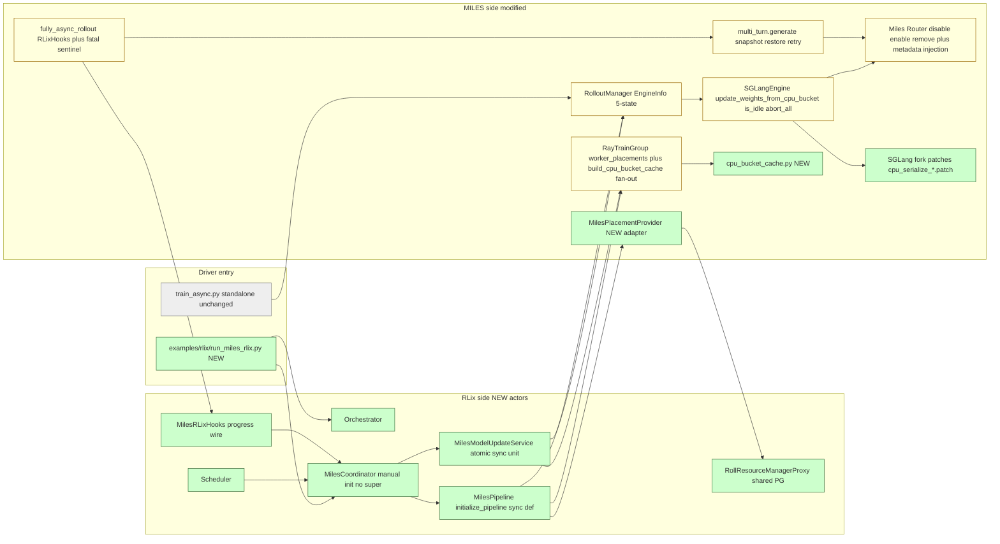
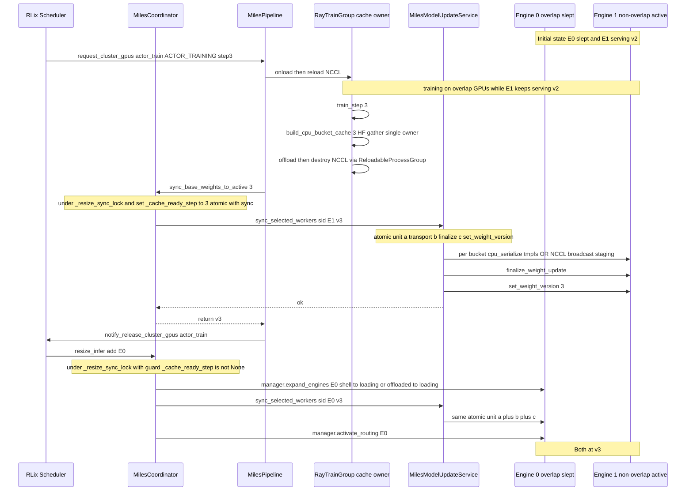
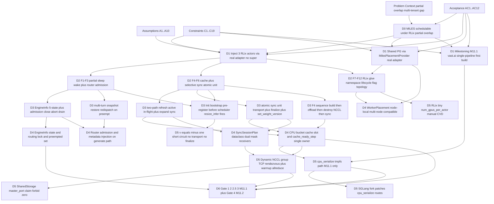
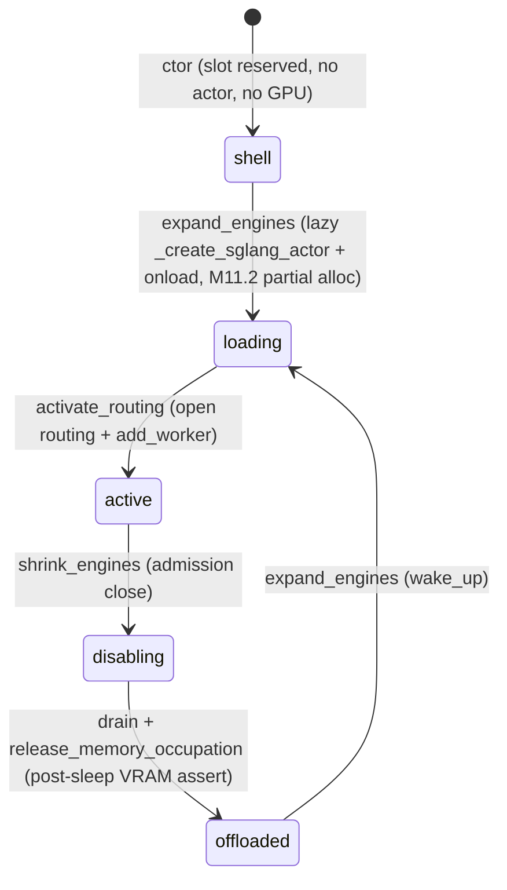
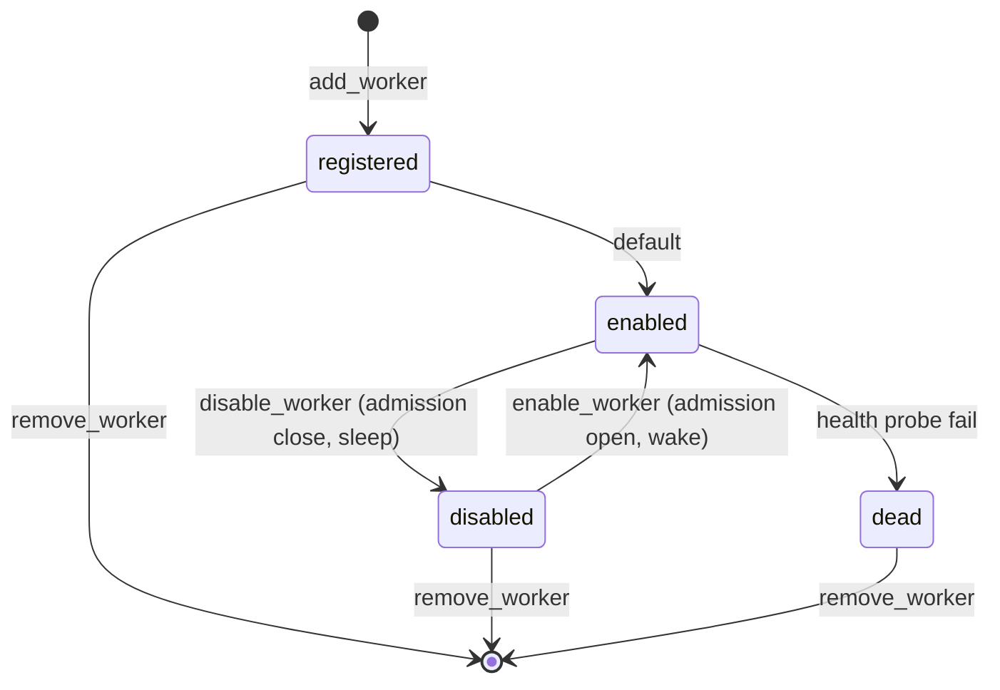

# TLDR Plan

Feature: **MILES → RLix port (fullasync GRPO under partial overlap)**
Source: [plans/miles-port-unified-plan.md](../plans/miles-port-unified-plan.md)

## 0. Audit Dashboard

- **Goal**: make MILES fullasync GRPO schedulable by RLix; partial overlap (`actor_train ⊂ actor_infer`) + subset sleep/wake + CPU bucket cache + selective sync.
- **Top-level decision (D1)**: 3 new RLix-side actors (`MilesPipeline`, `MilesCoordinator`, `MilesModelUpdateService`) + `MilesPlacementProvider` adapter; reuse `ReloadableProcessGroup`; manual-init `MilesCoordinator` (no `super`).
- **Main behavior change**: subset abort-drain-sleep + atomic sync unit (transport + finalize + version publish) + turn-level redispatch on preempt + dual-mask receivers.
- **Highest-risk decision**: **D3.d** atomic sync unit (single `_cache_lock` over full transport; v=-1 short-circuit; `_cache_ready_step` inside `_resize_sync_lock`).
- **Highest-risk assumption**: **A5** scheduler runs `resize_infer(add)` Phase 5 RPC BEFORE signaling pending GEN waiter (Phase 6).
- **Highest-risk constraint**: **C12** M11.1 forces `model_update_transport == "cpu_serialize"` (vast.ai container).
- **Most important decision to audit first**: **D3.d** + interaction with **A5** + **C13** (base-version equivalence at v=-1).
- **Likely touched module families**: MILES side: `ray/ + backends/{sglang_utils,megatron_utils}/ + router/ + rollout/ + examples/fully_async/`; 4 new files in `rlix/pipeline/`; new entry `examples/rlix/run_miles_rlix.py`; 4 vendored SGLang patches under `external/sglang/3rdparty/cpu_serialize/`. See Appendix B.
- **Must-not-change**: standalone `train_async.py`; existing `RolloutManager.update_weights_from_distributed/tensor`; existing `_send_to_colocated_engine` (standalone cuda_ipc); MILES tool-error group-recycle (orthogonal to RLix preempt); `ReloadableProcessGroup`.
- **User audit focus**: (1) F4 sequence (D3.f) + HF-format cache; (2) D3.d atomic unit + D5.c v=-1 short-circuit; (3) F10 fail-fast on M11.1 (C12 cpu_serialize, C6 contiguous mapping, C10 offload_train, C8 EP=1, C11 no async_save); (4) milestone scoping M11.1 vs M11.2/4/5/6.

## 1. Problem Context

- **Current system behavior**: MILES `train_async.py` runs fullasync GRPO standalone — owns its placement group, its rollout/training loop, its weight-update path (`RolloutManager.update_weights_from_distributed/tensor`). One MILES pipeline = one process = exclusive GPUs.
- **Problem / gap**: cannot run multiple MILES pipelines (or MILES + ROLL) on the same GPUs, because (a) no time-share scheduler arbitrates ownership across pipelines and (b) MILES weight-update path requires weights to live on the GPU at refit time, conflicting with releasing GPU back to a peer pipeline.
- **Why now**: ROLL/RLix already implements partial-overlap scheduling (`actor_train ⊂ actor_infer`, scheduler-driven shrink/expand) for vLLM-backed pipelines. Bringing MILES under the same scheduler unlocks GPU-density goals without re-platforming MILES.
- **System-visible impact if nothing is done**: MILES cannot co-tenant; throughput per GPU is bounded by single-pipeline utilization; no path to multi-tenant RL fleets.
- **Existing architecture context**: MILES owns SGLang inference workers + Megatron training actors, glued by `RolloutManager` and a custom `Miles Router`. RLix already provides `Orchestrator`, `Scheduler`, `PipelineCoordinator`, `ModelUpdateService`, `RollResourceManagerProxy`. Port = bridge from MILES side into these RLix abstractions.
- **Non-obvious background**: (a) SGLang `release_memory_occupation` keeps TP NCCL alive (vLLM-equivalent); (b) MILES has `ReloadableProcessGroup` already, so destroy/reload Megatron NCCL is free (NeMo had to add this); (c) MILES uses an out-of-process Miles Router (not in-process collective_rpc like vLLM), so admission control needs HTTP endpoints. Reference squash baseline: `41615af9` for staleness control + `9a0036447` for legacy custom-generate signature compatibility.

## 2. Assumptions

| ID | Assumption | Why it matters | Evidence / check | If it fails |
| -- | ---------- | -------------- | ---------------- | ----------- |
| A1 | First-build contiguous `infer_device_mapping` makes scheduler `dp_rank == MILES engine_index` an identity. | Lets `MilesPlacementProvider` skip the `scheduler_dp_rank → engine_index` lookup table. | F10 startup assert that mapping is sorted-contiguous (C6). | Non-contiguous mapping mis-routes shrink/expand; needs explicit lookup table (deferred to follow-up). |
| A2 | SGLang `release_memory_occupation` keeps TP NCCL communicator alive (vLLM-equivalent). | If destroyed, SGLang's own release path breaks (uses `barrier(tp_cpu_group)` internally). | Gate 2 (regression confirmation, not new risk). | Cannot fall back to destroy-and-re-init; ~50–200 MB NCCL buffer residue absorbed by `miles_post_sleep_vram_threshold_gb`. |
| A3 | Ray runtime auto-derefs top-level `ObjectRef` at remote-method boundary; wrapper receives `bytes`, not `ObjectRef`. | `update_weights_from_cpu_bucket(payload_bytes, ...)` signature relies on this. | `ray.put → ref → engine.method.remote(ref)` round-trip test. | `ray.get(payload_bytes)` raises `TypeError`; only surfaces at first sync. |
| A4 | `/dev/shm` is RAM-backed and `mmap`/`read` is effectively zero-copy. | tmpfs file path is the cpu_serialize transport between Ray wrapper and SGLang HTTP child. | Startup `shutil.disk_usage("/dev/shm")` check at F10. | Hot-path latency spikes; OOM if `/dev/shm` < bucket size + 256MB margin. |
| A5 | Scheduler executes `coordinator.resize_infer(add)` RPC in Phase 5 BEFORE signaling pending GEN waiter in Phase 6. | Init Step 6.6 must pre-register manager + service resources + base `_cache_ready_step=-1` BEFORE Step 7's GEN request, otherwise `_expand_workers` reads `None` and raises. | Read scheduler.py:1178-1187 + planner.py:418-425; Gate 4 (e) timestamp test verifies `T1 < T2 < T3`. | `_expand_workers` raises mid-init; Phase 2 cleanup. **Highest-risk assumption.** |
| A6 | Cache owner Megatron rank (`pp0+dp0+tp0+cp0` = `_is_distributed_src_rank`) is unique and stable across pipeline lifetime. | Init Step 6.5 collects exactly one owner; service caches it forever. | `collect_cache_owner_roles` returns exactly one `True`. | Multiple owners → duplicate writes; zero owners → empty cache. |
| A7 | SGLang `/v1/loads` returns `num_running_reqs + num_waiting_reqs` correctly per slot. | Drain hot path polls this; `/server_info` lacks the field. | Unit test: dispatch N requests, poll until 0. | False idle → release while requests in-flight → SGLang `assert is_fully_idle()` fires. |
| A8 | Bounded request-level mis-attribution during active-refresh is acceptable (in-flight may finish on old weights while engine reports new version). | Justifies "no drain-then-sync" design; aligns with NeMo `in_flight_weight_updates=True`. | Gate 3 quantifies count vs `in-flight × decode-step` bound. | Trajectory `weight_versions` becomes unreliable for `--max-weight-staleness`. |
| A9 | MILES tool-error / agentic group-recycle is orthogonal to RLix scheduler preempt. | Lets the port keep group-recycle untouched; turn-level redispatch is the *only* RLix preempt path. | Code grep: `Sample.Status.ABORTED` from tool error vs `EnginePreemptedError` from router metadata. | Mixing the two paths makes preempt look like silent retries; bugs hide. |
| A10 | MILES `ReloadableProcessGroup.destroy_process_groups + reload_process_groups` is correct and leak-free. | Lets the port skip NeMo-style `nccl_offload.py` (~90 lines) + Gate 2.5 fallback rule. | Gate 2.5 destroy/reload cycle ≥3 steps with VRAM monitoring. | NCCL group leak across train↔infer toggling; OOM after N steps. |

## 3. Scope & Constraints

### 3.1 Out of Scope

- **PD disaggregation** — not supported in any milestone.
- **vLLM backend** — only SGLang.
- **MoE / EP** (`expert_model_parallel_size > 1`, `moe_router_topk > 0`) — F4 cache covers dense Megatron only.
- **`sglang_data_parallel_size > 1`** — adds a DP axis the port does not handle.
- **Selective P2P weight transfer** — broadcast / tensor subset sync only; P2P is a follow-up.
- **Multi-LoRA / DPO / SFT** — LoRA RLix-mode rollout to **M11.4**; DPO/SFT entirely out.
- **Request-level deterministic migration** (ROLL `RequestScheduler`) — replaced by turn-level redispatch (NeMo F3 form).
- **Non-contiguous / custom-ordered `infer_device_mapping`** — first-build forces sorted contiguous; non-contiguous needs `scheduler_dp_rank → engine_index` lookup (follow-up).
- **`RadixTreeMiddleware` in RLix mode + `partial_rollout + radix_tree`** — disabled at startup; transparency / prefix-cache pollution are follow-up.
- **Cross-node single rollout (SGLang) engine** (intra-engine sharding spans nodes) — `WorkerPlacement` is per-node; multi-node DP with each engine node-local IS supported in M11.1.
- **Reading `cache_owner` internal state cross-process from the service** — owner is reported at init, not queried in sync hot path.
- **Branching RLix vs standalone inside `train_async.py`** — dual-entry: `train_async.py` standalone, `examples/rlix/run_miles_rlix.py` RLix.
- **Per-request id tracking inside `RolloutManager`** — replaced by SGLang `/v1/loads` idle bool.
- **Subclassing `PipelineCoordinator`** for `MilesCoordinator` — manual init only.
- **`args.async_save` in RLix train_step** — F10 fail-fast (M7 segfault).
- **`verify_model` debug validation** in receiver API — per-bucket barrier + warmup allreduce replace it.
- **Driver top-level `ray.shutdown()` + global `try/except`** — failures raise; user runs `ray stop` (M11.1 simplification).
- **Receiver crash tolerance / port pool / TIME_WAIT cooldown** — **M11.5** production hardening.
- **Multi-pipeline orchestrator-driven cleanup, admission_epoch race defense, graceful actor drain** — **M11.2** follow-ups (NOT Gate 4 pass criteria).
- **cuda_ipc colocate transport in M11.1** — vast.ai container blocks `--ipc=host` / `CAP_SYS_PTRACE`; cuda_ipc adapter ships in **M11.6**.

### 3.2 Hard Constraints

| ID | Constraint | Enforced by | Source |
| -- | ---------- | ----------- | ------ |
| C1 | `train_devices ⊂ infer_devices` (partial overlap topology) | F10 startup assert | `assert train_devices.issubset(infer_devices)` |
| C2 | `infer_engine_count >= 2` | F10 | `assert infer_engine_count >= 2` |
| C3 | `len(infer_devices - train_devices) >= rollout_num_gpus_per_engine` (≥1 non-overlap engine stays active after shrink) | F10 | derived |
| C4 | `sglang_data_parallel_size == 1` | F10 | `assert args.sglang_data_parallel_size == 1` |
| C5 | `rollout_num_gpus % rollout_num_gpus_per_engine == 0` | F10 | divisibility |
| C6 | First-build `infer_device_mapping` sorted-contiguous (per engine) | F10 | derived; relaxes when non-contiguous adapter ships |
| C7 | `rollout_num_gpus_per_engine <= num_gpus_per_node` (rollout engine node-local) | F10 (M3) | per-engine total GPU |
| C8 | `expert_model_parallel_size == 1` and `moe_router_topk == 0` (no MoE/EP) | F10 | `assert args.expert_model_parallel_size == 1` |
| C9 | `not has_pd_disaggregation` | F10 | `SglangConfig` property |
| C10 | `args.offload_train == True` | F10 | `actor.sleep()` asserts internally |
| C11 | `not args.async_save` (M7 segfault) | F10 | `assert not getattr(args, 'async_save', False)` |
| C12 | RLix mode `args.model_update_transport == "cpu_serialize"` (M11.1 only; M11.6 relaxes) | F10 | conditional on `DO_TIME_SHARING` |
| C13 | M11.1 `args.load ∈ {None, args.hf_checkpoint}` AND `args.ref_load ∈ {None, args.hf_checkpoint}` (Fix #14) | F10 | conditional on `DO_TIME_SHARING` |
| C14 | `actor_train` allocation must be FULL (no partial) | `_request_cluster_gpus` post-check | `assert set(allocated) == set(declared)` |
| C15 | Cache owner unique = `pp0+dp0+tp0+cp0` | init Step 6.5 `collect_cache_owner_roles` | exactly one True |
| C16 | `master_port != 0` for NCCL TCP rendezvous | service `setup_collective_group` | `get_free_port()` + SharedStorage claim |
| C17 | `RadixTreeMiddleware` not in `args.miles_router_middleware_paths` (RLix mode) | F10 | conditional on `DO_TIME_SHARING` |
| C18 | `not args.rollout_force_stream` (router metadata injection requires JSON) | F10 | `assert not getattr(args, 'rollout_force_stream', False)` |
| C19 | Single updateable model + single SGLang server group | F10 | `single_updateable_model_and_server(args)` |

### 3.3 Milestones

| Milestone | Scope | Key deliverables | Gates |
| --------- | ----- | ---------------- | ----- |
| **M11.1** | First build, vast.ai single-pipeline | F1–F12 happy path; cpu_serialize colocate (only); NCCL broadcast non-colocate; multi-node DP capable; turn-level redispatch; F10 fail-fasts (C6/C10/C11/C12/C13 enforced) | Gate 1, Gate 2, Gate 2.5, Gate 3 |
| **M11.2** | Dual-pipeline happy path | Shell partial GENERATION allocation; RolloutManager shell→loading→active lazy ctor; coordinator base v=-1 short-circuit (Fix #13); F10 startup fail-fast on resume (Fix #14); donor-shrink-before-recipient ordering | Gate 4 (c)+(d)+(e) happy path; admission_epoch race / graceful drain / multi-pipeline cleanup are M11.2-tagged but **NOT** Gate 4 pass criteria |
| ~~M11.3~~ | (skipped) | Cross-node rollout engine not supported; multi-node DP capability rolled into M11.1 | — |
| **M11.4** | LoRA + multi-stream aggregation | LoRA cpu_serialize / cuda_ipc adapter under RLix; multi-stream impl in F9 reporter (M11.1 hook signature already preserves `mode/adapter_id` nullable) | LoRA-specific gates (out of scope here) |
| **M11.5** | Production hardening | Ingress 503 + 5xx synthesis (preempt sentinel) + cleanup daemon + NCCL port hardening (port cooldown queue, receiver crash tolerance, conditional port leak, periodic port GC) | Production gates (out of scope here) |
| **M11.6** | cuda_ipc colocate transport | New cuda_ipc adapter (CPU cache → per-bucket H2D staging → IPC handle serialize, ~50–80 lines, NOT reusing `_send_to_colocated_engine`); startup smoke-test capability check | cuda_ipc gate added to Gate 2.5 cycle |

### 3.4 Strategy Comparison

| Alternative | When chosen | Trade-off | Status |
| ----------- | ----------- | --------- | ------ |
| **`cpu_serialize`** | Colocate receiver on M11.1 vast.ai | wrapper auto-deref bytes → tmpfs `/dev/shm/miles_cpu_bucket_{uuid}.pt` → SGLang HTTP route; ~1 extra copy through plasma + tmpfs (memcpy-bound); requires no special container caps | **M11.1 default + only colocate transport** |
| **`cuda_ipc`** | Colocate receiver on M11.6 production | Zero-copy GPU IPC handle (baseline performance); requires `--ipc=host` or `CAP_SYS_PTRACE`; **must use new adapter** (CPU cache → per-bucket H2D staging → IPC serialize) NOT reuse standalone `_send_to_colocated_engine` (live `dist.gather_object` conflicts with F4 destroy-NCCL ordering) | M11.6 only; standalone cuda_ipc path unchanged |
| **NCCL broadcast** | Non-colocate receiver — **all milestones, partial-overlap requirement** | TCP rendezvous + warmup allreduce + per-bucket H2D staging on cache_owner GPU + dynamic group destroy with `is_group_exist` no-op guard for colocate-only ranks | Always required |

Receiver-side dual-mask: `cpu_serialize_local_ranks` (M11.1 colocate) + `broadcast_local_ranks` (always) + `ipc_local_ranks` (M11.6); each receiver method skips when its rank not in mask.

### 3.5 Acceptance Criteria

Outcome-level (Tier 1) commitments to the human at delivery time. `Derives from` cites only Goal / `An` / `Cn` / `Mn` (allow-list); never `Dn`.

| ID | Acceptance Criterion (outcome) | Derives from | Verified by | Milestone |
| -- | ------------------------------ | ------------ | ----------- | --------- |
| AC1 | MILES fullasync GRPO runs end-to-end under RLix scheduler with a single pipeline (4 GPU, tp=2 partial overlap) | `Goal`, `A8`, `M11.1` | E3 | M11.1 |
| AC2 | Trajectory `weight_versions` is consumable by `--max-weight-staleness 2` (per-decision version label is preserved end-to-end) | `A8`, `M11.1` | E3 | M11.1 |
| AC3 | Subset sleep/wake of overlap engines releases GPU VRAM while non-overlap engines keep serving (post-sleep VRAM under `args.miles_post_sleep_vram_threshold_gb`) | `Goal`, `A2`, `A7`, `M11.1` | E1 | M11.1 |
| AC4 | tp>1 mixed receiver mask sync (cpu_serialize colocate + NCCL broadcast non-colocate in same bucket) succeeds without leak under M11.1 transport (`cpu_serialize` only, `C12`) | `C5`, `C12`, `C16`, `M11.1` | E2 | M11.1 |
| AC5 | Megatron NCCL destroy/reload cycle stable across ≥3 train→sync→train iterations (no VRAM leak, no NCCL group leak) | `A10`, `M11.1` | E9 | M11.1 |
| AC6 | Multi-turn preempt resumes from the aborted turn (preserving completed turns); exhausting `MAX = total_engine_count` raises `EnginePreemptedError` (no silent group-recycle) | `A9`, `M11.1` | E4 | M11.1 |
| AC7 | F10 startup fail-fasts reject misconfigurations: non-contiguous mapping, async_save, RadixTreeMiddleware, streaming, EP/MoE>1, sglang_data_parallel_size>1, transport mismatch, resume args | `C1`,`C2`,`C3`,`C4`,`C5`,`C6`,`C7`,`C8`,`C9`,`C10`,`C11`,`C12`,`C13`,`C17`,`C18`,`C19`, `M11.1` | E7, E8 | M11.1 |
| AC8 | Standalone `train_async.py` continues to run unchanged when `RLIX_CONTROL_PLANE` is unset (no behavioral regression on the standalone path) | `Goal`, `M11.1` | E10 | M11.1 |
| AC9 | Two MILES pipelines admitted under one orchestrator share GPUs via `RollResourceManagerProxy`; both schedulable on the same physical GPUs | `Goal`, `A1`, `M11.2` | E11 | M11.2 |
| AC10 | Pipeline B init under contention gets a partial GENERATION allocation: shell engines stay shell (no Ray actor, no GPU), active engines serve correctly, router worker list contains only active subset | `C14`, `M11.2` | E12 | M11.2 |
| AC11 | Expand-before-first-after_training uses base v=-1 short-circuit (no transport, no finalize, only `manager.set_weight_version(-1)`); engine reports v=-1 base label equivalent to `args.hf_checkpoint` weights | `C13`, `M11.2` | E5 | M11.2 |
| AC12 | Donor-shrink-before-recipient-expand ordering enforced: `T1 < T2 < T3` (A.shrink returns < B.expand starts < B.request returns) — Pipeline B never spawns Ray/SGLang actor on GPUs A still holds | `A5`, `M11.2` | E13 | M11.2 |

## 4. Critical Views

### 4.1 Architecture Integration View

*Audit question: where does the new control plane attach to existing MILES, and what stays unchanged?*



Standalone `train_async.py` unchanged; new RLix entry `run_miles_rlix.py` drives the orchestrator chain. `MilesCoordinator` does NOT subclass `PipelineCoordinator`. `MilesPlacementProvider` is a real adapter from ROLL `List[List[Dict]]` to MILES per-worker `WorkerPlacement`. SGLang vendored fork patches add a single new HTTP admin route + in-process `torch.load` path.

### 4.2 Runtime / Data Path View

*Audit question: how does the steady-state train step plus scheduler-driven expand sequence work, and what holds the atomic invariant?*



Atomic unit covers (a) per-bucket transport + (b) per-engine `finalize_weight_update` fan-out + (c) `manager.set_weight_version`, all within one `ROLL_SELECTIVE_MODEL_UPDATE_TIMEOUT_S`. Pipeline never directly calls finalize or `set_weight_version`. `_cache_ready_step` updated inside `_resize_sync_lock` BEFORE the service call returns. Per-bucket payload carries NO `weight_version` (avoids version inversion). v=-1 short-circuit (Fix #13/#15) skips (a)+(b), runs only (c).

Error paths: receiver hang → 150s timeout → coordinator → pipeline crash (fail-fast); turn redispatch exhausted → `EnginePreemptedError` → fully_async fatal sentinel → pipeline crash (NOT silent group recycle); router metadata missing in RLix mode → `RLixRouterMetadataError` → fatal sentinel.

### 4.3 Physical Topology View

*Audit question: which logical roles share which physical GPUs in the M11.1 dev gate (4 GPU, tp=2)?*

ASCII layout — Mermaid cannot express overlap rectangles cleanly:

```text
Node 0 (4 GPU dev gate)

GPU lane:           GPU 0       GPU 1       GPU 2       GPU 3
                    -----       -----       -----       -----
actor_train      [============]                                       (overlap subset)
actor_infer      [================================================]   (full set)
SGLang Engine 0  [============]                                       (TP=2, overlap GPUs)
SGLang Engine 1                              [============]            (TP=2, non-overlap)

Behavior:
- During train: Engine 0 sleep_partial (release weights+kv+graph); Engine 1 keeps serving.
- After train + sync: Engine 0 wake_up; selective sync to E0; activate_routing.
- Active set bootstrap: Coordinator._active_engine_indices = {1} initially; expand adds {0}.
```

Multi-node DP supported in M11.1 (each engine still node-local):

```text
Node 0:  train [0,1] + infer engine0 [0,1] + infer engine1 [2,3]
Node 1:  infer engine2 [0,1] + infer engine3 [2,3]   (multi-node DP, each engine node-local)
```

Cross-node single rollout engine FORBIDDEN in M11.1 — `WorkerPlacement.placement_group` is per-node; a single SGLang engine occupying GPUs [0,1] on node0 + [0,1] on node1 violates **C7**.

## 5. Decision Map

*Audit question: which assumptions, constraints, and acceptance criteria derive each decision?*



| Decision | Chosen | Depends On (Ctx / A / C / Dn) | AC served | Audit |
| -------- | ------ | ----------------------------- | --------- | ----- |
| D0 | Goal: partial overlap, subset sleep/wake, CPU bucket cache, selective sync | Ctx | AC1, AC8, AC9 | scope alignment vs ROLL/NeMo F1–F12 |
| D1.A | RLix actor injection: 3 new actors `MilesPipeline / MilesCoordinator / MilesModelUpdateService`; manual-init `MilesCoordinator` | D0, A6, C1–C9 | AC1, AC9 | confirm no `super().__init__` to ROLL |
| D1.B | Shared PG: real `MilesPlacementProvider` adapter on shared `RollResourceManagerProxy` | D0, A1 | AC9 | provider receives proxy by injection; `WorkerPlacement` per-worker |
| D1.C | Milestoning: M11.1 cpu_serialize-only first build; M11.2 dual-pipeline; M11.4 LoRA; M11.5 hardening; M11.6 cuda_ipc | D0, C12 | AC1, AC9 | feature labels match milestone tags |
| D2.A | Sleep/wake/route module: F1+F2+F3 owned by `RolloutManager` + Miles Router | D1.A | AC3, AC6 | engine_index single dim (TP fan-out internal) |
| D2.B | Cache + sync module: F4+F5+F6 owned by service; cache owner = `_is_distributed_src_rank` | D1.A, A6 | AC1, AC4, AC11 | single slot; `_cache_lock` covers full transport |
| D2.C | RLix glue: F7–F12 (one merged adapter file allowed but capabilities preserved) | D1.A, D1.B | AC7, AC8 | namespace + reg + `DO_TIME_SHARING` preserved as 3 capabilities |
| D3.A | Sleep/wake: admission close → abort → drain (`/v1/loads`, A7) → release → post-sleep VRAM assert | D2.A | AC3 | drain reads `/v1/loads`, NOT `/server_info` |
| D3.B | Turn redispatch: snapshot/restore in `multi_turn.py`; `MAX_ATTEMPTS = total_engine_count`; exhaust → fail fast | D2.A, A9 | AC6 | counter is total (incl. sleeping) NOT active |
| D3.C | Two-path refresh: active in-flight (after_training) + expand sync (scheduler-driven), share one cache | D2.B, A8 | AC1, AC2 | pipeline does NOT call expand path |
| D3.D | Atomic sync unit: `service.sync_selected_workers` does (a)+(b)+(c) within one timeout | D2.B | AC1, AC4 | pipeline never calls finalize / set_weight_version directly |
| D3.E | Init pre-register: Step 6.6 pre-registers manager + service + base version + active bootstrap BEFORE Step 7 GEN | D2.A, D2.B, A5 | AC10, AC11, AC12 | Phase 5 before Phase 6; Gate 4 (e) timestamp test |
| D3.F | F4 sequence: build CPU cache → offload → destroy NCCL → sync, in this order | D2.B, A6 | AC4, AC5 | reordering deadlocks gather (build after offload) or serves stale (sync before offload) |
| D4.A | EngineInfo: 5-state (`shell/active/disabling/offloaded/loading`) single source of truth | D3.A | AC3, AC10 | no worker-side `is_engine_resident_on_gpu` flag |
| D4.B | Router admission: `/disable_worker` `/enable_worker` `/remove_worker` + metadata mutation on `/generate` only | D3.A, D3.B | AC3, AC6 | disabled NOT in `_use_url`; health-check excludes disabled |
| D4.C | Version label: `version = _cache_ready_step`; single-shot `manager.set_weight_version`; updated inside `_resize_sync_lock` | D3.C, D3.D, D3.F | AC2, AC11 | per-bucket payload carries NO version field |
| D4.D | WorkerPlacement: per-worker, node-local gpu_ids, multi-node compatible | D1.B, D2.C, C7 | AC9 | `base_gpu_id=0` post-CVD local; never `wp.gpu_ids[0]` physical |
| D4.E | SyncSessionPlan: frozen dataclass; `target_handles` + per-engine masks; built once per sync at service entry | D3.C, D3.D | AC4 | cache_owner does NOT call back to service / manager |
| D5.A | cpu_serialize: M11.1 colocate; ObjectRef → tmpfs → HTTP route | D4.C, D1.C, A3, A4, C12 | AC4 | F10 asserts transport |
| D5.B | Dynamic NCCL: TCP rendezvous (NOT `dist.new_group`) + warmup allreduce + `is_group_exist` no-op destroy | D4.C, D4.E | AC4, AC5 | sender H2D staging only for NCCL receivers |
| D5.C | v=-1 short-circuit: skip transport + finalize; only `manager.set_weight_version(-1, targets)` | D3.E | AC11 | Gate 4 (d) instrumented call counters |
| D5.D | SGLang fork patches: 4 patches under `external/sglang/3rdparty/cpu_serialize/` | D5.A | AC4 | rebase per SGLang bump |
| D5.E | master_port: `get_free_port()` + SharedStorage claim, never 0 | D5.B, C16 | AC9 | F10 forbids `port=0` |
| D5.F | Tiny GPU + manual CVD: RLix path uses `num_gpus_per_actor=0.01` + manual CVD + `RAY_EXPERIMENTAL_NOSET_CUDA_VISIBLE_DEVICES=1` + `local_rank=0` | D2.C | AC9 | no env mutation post-import |
| D6 | Gates: Gate 1/2/2.5/3 = M11.1; Gate 4 = M11.2 happy path; cuda_ipc gate = M11.6 | D3, D5 | AC1, AC9 | Gate 2.5 covers dual-mask `tp>1` |

## 6. Evidence & Stop Conditions

This section **mirrors what the plan tells the agent**. tldr-plan does not invent new evidence or stop conditions — only surfaces what the plan defines and flags gaps the human auditor should fix in the plan before shipping.

#### 6.1 Evidence Required (per plan)

| ID | Binds to (D / A / C / M) | AC verified | Evidence the plan defines | Before Done? |
| -- | ------------------------ | ----------- | ------------------------- | ------------ |
| E1 | D3.A, A7 | AC3 | Gate 1 (a)/(b): `_preempted_engines` set+cleared; post-sleep VRAM under threshold (read SGLang `/server_info` `memory_usage` GB, NOT actor `torch.cuda`) | yes |
| E2 | D3.D, C16 | AC4 | Gate 2.5: mixed-mask sync (cpu_serialize + NCCL broadcast in same bucket); per-bucket barrier; warmup allreduce on every NCCL group CREATE; `is_group_exist` no-op DESTROY | yes |
| E3 | D3.C, A8 | AC1, AC2 | Gate 3: long-running fullasync GRPO with active in-flight refresh; quantify mis-attribution count vs in-flight × decode-step; trajectory `weight_versions` consumable by `--max-weight-staleness 2` | yes |
| E4 | D3.B, A9 | AC6 | Gate 3 (d): inject `sleep_partial` mid-turn; verify redispatch picks new engine and preserves completed turns; exhaustion raises `EnginePreemptedError` (NOT silent group recycle) | yes |
| E5 | D3.E, A5, C13 | AC11 | Gate 4 (d): instrumented assertions that `cache_owner_actor.run_sync_session` AND per-engine `finalize_weight_update` call counters remain at pre-expand values for v=-1 path | yes (M11.2) |
| E6 | D3.D, D4.C |  | Per-bucket payload audit: NO `weight_version` field; finalize call counter audit; `set_weight_version` audit | yes |
| E7 | C13 | AC7 | F10 startup assert that `args.load` and `args.ref_load` are in {None, `args.hf_checkpoint`} when `DO_TIME_SHARING` is true | yes |
| E8 | C12, C17, C18 | AC7 | F10 startup asserts on RLix mode misconfiguration (transport, RadixTree, streaming) | yes |
| E9 | A10, D3.F | AC5 | Gate 2.5 destroy/reload cycle ≥3 steps; verify VRAM after offload + no NCCL group leak | yes |
| E10 | D2.C | AC8 | Standalone `train_async.py` smoke test still passes when `RLIX_CONTROL_PLANE` is unset (no behavioral regression on the standalone path) | yes |
| E11 | D1.B, D1.C | AC9 | Gate 4 setup: two MILES pipelines admitted under one orchestrator share `RollResourceManagerProxy`; per-pipeline namespace isolation verified | yes (M11.2) |
| E12 | D3.E, D4.A, C14 | AC10 | Gate 4 (c): Pipeline B partial allocation — verify all of: init returns SUCCESS, `coordinator.get_active_engines()` returns active subset, shell engines have `handle is None`, router worker list contains only active subset, M1 subset assert passed, Step 7.3 consistency assert passed | yes (M11.2) |
| E13 | D3.E, A5 | AC12 | Gate 4 (e): timestamp test on coordinator + driver verifies `T1 (A.shrink returns) < T2 (B.expand starts) < T3 (B.request returns)` | yes (M11.2) |

#### 6.2 Stop Conditions (per plan)

The plan instructs the agent to stop and ask if:

- implementation requires touching out-of-scope files
- a lower-level implementation decision lacks a parent decision
- required tests force changing expected old behavior (standalone path or tool-error group recycle)
- the architecture insertion point appears wrong after code inspection (e.g. `MilesCoordinator` cannot avoid `super().__init__`)
- public API compatibility must be broken (e.g. existing `RolloutManager(args, pg=...)` standalone signature)
- assumption A1 / A5 / A6 fails during implementation (cache_owner reports zero or multiple owners; `_expand_workers` reads `_cache_ready_step is None` mid-init)
- the atomic-unit invariant (D3.D / E6) cannot be preserved without splitting RPCs
- v=-1 short-circuit cannot be implemented because base weights from `args.hf_checkpoint` differ from `build_cpu_bucket_cache(-1)` bytes (C13 must not be loosened)
- topology asserts in F10 conflict with feasible deployment (e.g. user reports vast.ai container has `--ipc=host` after all → revisit C12)

(The plan defines no stop condition for the M11.2 multi-pipeline race scenarios — admission_epoch race, donor-shrink race — those are tagged "M11.2 follow-up, not Gate 4 pass criteria"; audit gap, see `## 7`.)

## 7. Audit Checkpoints

Two lenses: **Intent** (does the plan reflect what the human wants?) and **Shippability** (will the agent reading the plan have to guess?).

- [ ] **Intent**: `## 1 Problem Context` accurately frames why MILES needs RLix scheduling — partial overlap multi-tenancy is the correct goal.
- [ ] **Intent**: `## 3.1 Out of Scope` correctly excludes MoE/EP, vLLM, PD, request-level migration — the human is intentionally leaving these out.
- [ ] **Intent**: `## 3.4 Strategy Comparison` choice of `cpu_serialize` for M11.1 reflects actual deployment target (vast.ai container) — not a temporary expedient.
- [ ] **Intent**: AC1–AC12 (§3.5) cover what the human auditor expects to receive at each milestone — no missing user-visible outcomes.
- [ ] **Intent**: D1.a / D1.b / D1.c (3 new RLix-side actors + adapter, manual `MilesCoordinator`, M11.x phasing) match the human's intended integration shape.
- [ ] **Intent**: assumptions **A5** (Phase-5-before-Phase-6) and **A8** (bounded mis-attribution during active refresh) are risks the human is willing to bet on.
- [ ] **Intent**: M11.x phasing (M11.1 first, M11.2 dual-pipeline, M11.4 LoRA, M11.5 hardening, M11.6 cuda_ipc) reflects the human's actual delivery cadence.
- [ ] **Shippability**: hard constraints C1–C19 are present in the plan with concrete F10 enforcement points — the agent will encounter and respect them.
- [ ] **Shippability**: every `Dn` in §5 cites ≥1 `AC` in §3.5 (no orphan decisions; a `Dn` with no `AC` is either over-engineering or a hidden goal).
- [ ] **Shippability**: every `AC` in §3.5 has at least one `D` citing it AND at least one `E` verifying it (no orphan promises, no unverifiable promises).
- [ ] **Shippability**: D3.d atomic sync unit + D5.c v=-1 short-circuit are described concretely enough in the plan that the agent will not split the RPC or skip the version-label publish (E2, E5, E6 enforce).
- [ ] **Shippability**: D3.f F4 sequence is unambiguous in the plan; the agent will not reorder steps or build cache after offload (E9 enforces).
- [ ] **Shippability**: cache owner discovery happens at init (Step 6.5 `report_cache_owner_role`) and NOT in sync hot path — A6 holds.
- [ ] **Shippability**: stop conditions (`## 6.2`) are present in the plan; the agent has clear halt points (mirroring §6.2).
- [ ] **Shippability**: evidence E1–E13 is achievable before the agent declares done — gate procedures are specified concretely (`/server_info` field names, `/v1/loads` endpoint, instrumented counter expectations, `T1<T2<T3` timestamp test).
- [ ] **Shippability gap**: the plan does not define explicit stop conditions for M11.2 multi-pipeline race scenarios (admission_epoch / donor-shrink). Decide whether to add them to the source plan or accept "M11.2 follow-up; manual `ray stop` recovery" as the agent's policy.
- [ ] **Shippability gap**: receiver crash tolerance is classified M11.5; verify the agent will not silently add fault-tolerant port management on the M11.1 path.

## Appendix A: Full Decision Trace

| Decision | Layer | Chosen | Rejected | Depends On | Unlocks | User Audit |
| -------- | ----- | ------ | -------- | ---------- | ------- | ---------- |
| D0 Goal | D0 | partial overlap multi-tenancy | tp=1 MVP; standalone-only | Ctx | all features | scope freeze |
| D1.A RLix actor injection | D1 | new `MilesPipeline / MilesCoordinator / MilesModelUpdateService`; manual init | subclass `PipelineCoordinator`; reuse `FullFinetunePipeline` | D0, A6 | F5+6, F7–F11 | confirm no `super().__init__` to ROLL coordinator |
| D1.B Shared PG | D1 | real `MilesPlacementProvider` adapter on shared `RollResourceManagerProxy` | self-built PG; `RayVirtualCluster`-style wrapper | D0, A1 | F12 | adapter materializes ROLL `List[List[Dict]]` to `WorkerPlacement` |
| D1.C Milestoning | D1 | M11.1 cpu_serialize-only first build then M11.2/4/5/6 | one-shot full parity; tp=1 → tp>1 staged | D0, C12 | all | feature labels match milestone tags |
| D2.A Sleep/wake/route module | D2 | F1+F2+F3 owned by `RolloutManager` + Miles Router | per-engine self-managed sleep | D1.A | F5+6 | engine_index single dim |
| D2.B Cache + sync module | D2 | F4+F5+F6 owned by service; cache owner = `_is_distributed_src_rank` | dual cache slots; per-step versioned slots | D1.A, A6 | D3.D | single slot; `_cache_lock` covers full transport |
| D2.C RLix glue | D2 | F7–F12 (one merged adapter file allowed) | merge namespace+lifecycle+flag into one capability | D1.A, D1.B | D6 | namespace + reg + `DO_TIME_SHARING` preserved |
| D3.A Subset abort-drain-sleep | D3 | admission close → abort → drain via `/v1/loads` → release → post-sleep VRAM assert | per-request id tracking | D2.A, A7 | F1, F2 | drain reads `slot["num_total_reqs"]`, NOT `/server_info` |
| D3.B Turn-level redispatch | D3 | snapshot → retry, fail-fast on exhaustion | request-level deterministic migration | D2.A, A9 | F3 | commit-after-success; MAX = total_engine_count |
| D3.C Two-path refresh | D3 | active in-flight + expand sync; same atomic unit | drain-then-sync; per-engine separate caches | D2.B, A8 | F5+6 | tolerated bounded mis-attribution |
| D3.D Atomic sync unit | D3 | `service.sync_selected_workers` does (a)+(b)+(c) | per-bucket version; pipeline-driven finalize; split RPCs | D2.B | F4, F5+6 | pipeline never calls finalize directly |
| D3.E Init pre-register | D3 | Step 6.6 pre-registers everything BEFORE Step 7 GEN | lazy registration after `_expand_workers` | D2.A, D2.B, A5 | F4, F5+6, F12 | Phase 5 before Phase 6 |
| D3.F F4 sequence | D3 | build → offload → destroy NCCL → sync | build after offload; sync before offload | D2.B, A6 | F4 | reordering deadlocks gather |
| D4.A EngineInfo | D4 | 5-state dataclass single dict | 5 parallel maps; `is_engine_resident_on_gpu` bool | D3.A | F2 | shell semantics for M11.2 partial allocation |
| D4.B Router metadata | D4 | mutate JSON body in `do_proxy` (path == "generate") + admission state | header-only; SSE streaming | D3.A, D3.B | F3 | `Content-Encoding` stripped; payload re-serialized |
| D4.C `_cache_ready_step` | D4 | single cache, `_cache_ready_step` updated inside `_resize_sync_lock` | ROLL double-buffer; version bump per sync | D3.D, D3.F | F4, F5+6 | `sync_base_weights_to_active(step)` accepts step explicitly |
| D4.D WorkerPlacement | D4 | per-worker, node-local gpu_ids, multi-node compatible | global GPU id assumption; cluster wrapper | D1.B, D2.C, C7 | F12 | `base_gpu_id=0` post-CVD local |
| D4.E SyncSessionPlan | D4 | frozen dataclass; `target_handles` + per-engine masks; built once at sync entry | service hot-path RPC to manager per bucket | D3.D | F4, F5+6 | cache_owner does NOT call back |
| D5.A cpu_serialize tmpfs | D5 | `/dev/shm/miles_cpu_bucket_{uuid}.pt` + HTTP path | base64 in HTTP body; ObjectRef ID via subprocess `ray.init` | D4.C, A3, A4 | F4 (M11.1) | wrapper-owned cleanup |
| D5.B Dynamic NCCL group | D5 | per-sync CLASSIFY/CREATE/USE/DESTROY + warmup allreduce | persistent group; `dist.new_group` (cross-process invalid) | D4.C, D4.E | F4 (non-colocate) | per-bucket barrier before staging free |
| D5.C v=-1 short-circuit | D5 | service skips transport + finalize; only publishes label | run full transport on init bootstrap | D3.E | Gate 4 (d) | NO `run_sync_session` call; NO finalize; NO cache_owner GPU touch |
| D5.D SGLang fork patches | D5 | 4 patches under `external/sglang/3rdparty/cpu_serialize/` | upstream PR; vendored fork only | D5.A | F4 receiver | rebase per SGLang bump |
| D5.E master_port via SharedStorage | D5 | `get_free_port()` + SharedStorage claim | `master_port=0`; static config | D5.B, C16 | NCCL group | port 0 breaks multi-rank rendezvous |
| D5.F Tiny num_gpus_per_actor + manual CVD | D5 | RLix `num_gpus_per_actor=0.01` + manual CVD + NOSET env + `base_gpu_id=0` + `local_rank=0` | standalone fractional `0.4` reused; `wp.gpu_ids[0]` physical id | D2.C | F12 | no env mutation post-import |
| D6 Gates | D6 | Gate 1/2/2.5/3 M11.1; Gate 4 M11.2; cuda_ipc M11.6 | tp=1 MVP gate | D3, D5 | M11.1 sign-off | Gate 2.5 dual-mask `tp>1` coverage |

## Appendix B: Full Module / File Boundary

| File / Module | Role | Allowed Change | Forbidden Responsibility | Parent Decision |
| ------------- | ---- | -------------- | ------------------------ | --------------- |
| [miles/ray/rollout.py](../external/miles/miles/ray/rollout.py) | RolloutManager + EngineInfo + routing lock | add `EngineInfo`, `shrink/expand_engines`, `activate_routing`, `set_weight_version`, subset APIs, `get_engine_handles`, `get_engine_count`, per-pipeline empty router on ctor | direct `service.X.remote` calls; per-request id tracking; `add_worker` outside `activate_routing`; `remove_worker` outside `shrink_engines` | D2.A, D4.A |
| [miles/backends/sglang_utils/sglang_engine.py](../external/miles/miles/backends/sglang_utils/sglang_engine.py) | SGLang Ray actor wrapper | add `update_weights_from_cpu_bucket`, `is_idle` (`/v1/loads`), `abort_all_requests`, post-sleep VRAM assert (server-side); M11.6 add `ipc_local_ranks` arg | reading actor-side `torch.cuda.memory_allocated()`; `os.environ['CUDA_VISIBLE_DEVICES']=...` after import | D3.A, D5.A |
| [miles/router/router.py](../external/miles/miles/router/router.py) | Miles Router admission state | add `/disable_worker` `/enable_worker` `/remove_worker`; mutate JSON body of `/generate` only; 4-dict worker lifecycle; `_use_url` filters `enabled - dead`; health-check excludes disabled | mutating non-`/generate` endpoints; admission_epoch race defense; polling disabled workers | D4.B |
| [miles/rollout/generate_hub/multi_turn.py](../external/miles/miles/rollout/generate_hub/multi_turn.py) | Multi-turn trajectory generator | drop `partial_rollout` assert; force `payload["stream"]=False`; snapshot-then-retry; `MAX_ATTEMPTS = total_engine_count`; raise `EnginePreemptedError` on exhaustion | swallow `EnginePreemptedError`; group-recycle as fallback; replay env steps on aborted turn | D3.B |
| [miles/rollout/base_types.py](../external/miles/miles/rollout/base_types.py) | Shared types | add `EnginePreemptedError`, `RLixRouterMetadataError` | extending `GenerateFnInput` schema | D3.B |
| [miles/rollout/generate_utils/generate_endpoint_utils.py](../external/miles/miles/rollout/generate_utils/generate_endpoint_utils.py) | Sample state mutation helpers | add `_snapshot_turn_state` / `_restore_turn_state` (length-only, not deep copy) | deep-copy entire sample | D3.B |
| [miles/ray/actor_group.py](../external/miles/miles/ray/actor_group.py) | RayTrainGroup | accept `worker_placements` + `num_gpus_per_actor=0.01`; `build_cpu_bucket_cache` fan-out; `collect_cache_owner_roles`; ctor self-cleanup; pass `local_rank=0` in RLix path | sharing actor handles across pipelines; using fractional `0.4` in RLix path | D2.C, D5.F |
| [miles/ray/train_actor.py](../external/miles/miles/ray/train_actor.py) | TrainRayActor | accept optional `local_rank` kwarg | break standalone `get_local_gpu_id()` fallback | D5.F |
| miles/ray/placement_provider.py (NEW) | ROLL ↔ MILES placement adapter | `MilesPlacementProvider` + `WorkerPlacement` dataclass; `get_all_rollout_engine_placements` (declared full table); `get_active_engine_indices`; `get_train_workers` | self-instantiate `RollResourceManagerProxy`; derive device mapping via `list(range(...))` | D1.B, D4.D |
| [miles/ray/placement_group.py](../external/miles/miles/ray/placement_group.py) | Standalone PG factory | accept `external_provider=None` (None → standalone unchanged) | branch standalone behavior | D2.C |
| miles/backends/megatron_utils/update_weight/cpu_bucket_cache.py (NEW) | CPU bucket build + lookup + version label | pinned CPU buckets; HF-converted bytes; single slot covering writes; `_cache_ready_step` label | multiple slots; raw Megatron state_dict; lazy build on sync hot path | D2.B, D4.C |
| [miles/backends/megatron_utils/actor.py](../external/miles/miles/backends/megatron_utils/actor.py) | MegatronTrainRayActor + sender API | add `build_cpu_bucket_cache(step)`, `report_cache_owner_role()`, `run_sync_session(plan)` (cache_owner holds `_cache_lock` in single method) | call back to service or manager during `run_sync_session`; split into multiple top-level RPCs | D3.D, D4.E |
| [miles/utils/arguments.py](../external/miles/miles/utils/arguments.py) | CLI args | add `miles_model_update_bucket_size_mb`, `miles_post_sleep_vram_threshold_gb`, `model_update_transport` | add `device_mapping` args (derive only) | D5 |
| miles/utils/rlix_hooks.py (NEW) | `RLixHooks` protocol + `NoOpRLixHooks` | import seam | importing RLix wire types into MILES code | D2.C |
| [examples/fully_async/fully_async_rollout.py](../external/miles/examples/fully_async/fully_async_rollout.py) | fully_async outer loop | accept `rlix_hooks=None`; call `begin/bump_completed/end_progress_batch`; `_FatalError` queue sentinel for `(EnginePreemptedError, RLixRouterMetadataError)` | importing `ProgressReport` or coordinator handle; reading `worker.buffer` (does not exist) | D3.C, A8 |
| [train_async.py](../external/miles/train_async.py) | Standalone entry | add fail-fast guards (`RLIX_CONTROL_PLANE` set → raise; partial-overlap topology + flag unset → raise) | branching RLix behavior internally | D2.C |
| examples/rlix/run_miles_rlix.py (NEW) | RLix entry driver | orchestrator + coordinator + pipeline.initialize_pipeline + main loop | top-level try/except + `ray.shutdown` (raise propagate; `ray stop` CLI) | D2.C |
| rlix/pipeline/miles_pipeline.py (NEW) | RLix-side `MilesPipeline` actor | sync `initialize_pipeline` (use `run(coro)`); train/infer cluster lifecycle; F10 validation; Phase 1 + Phase 2 cleanup | `async def initialize_pipeline`; mixing sync `_request_cluster_gpus` with asyncio.Lock | D1.A, D2.C, D3.E |
| rlix/pipeline/miles_coordinator.py (NEW) | `MilesCoordinator` (manual init, NOT subclass) | `bootstrap_active_engines`, `publish_cache_ready_step`, `register_model_update_resources`, `sync_base_weights_to_active(step)`, `resize_infer / _expand_workers`; manual init of `_resize_sync_lock`, `_active_engines_bootstrapped` flag; `sync_lora_weights` ABC stub | `super().__init__()` to `PipelineCoordinator` (would invoke ROLL config validators) | D1.A, D2.B |
| rlix/pipeline/miles_model_update_service.py (NEW) | sync atomic unit | per-bucket transport + finalize fan-out + `set_weight_version`, all in one timeout; v=-1 short-circuit; `master_port` claim; `SyncSessionPlan` build at sync entry; service holds both `cache_owner_actor` and `rollout_manager` handles | leak ObjectRef beyond sync barrier; persistent NCCL group across syncs; cuda_ipc on M11.1 path | D2.B, D3.D, D5.A, D5.B, D5.C |
| rlix/pipeline/miles_hooks.py (NEW) | `MilesRLixHooks` real impl | wire-format packing for `ProgressReport` | reading MILES internals | D2.C |
| external/sglang/3rdparty/cpu_serialize/*.patch (NEW) | SGLang fork patches | new HTTP route + scheduler dispatch + in-process `torch.load` + writer_lock acquire/release | persistent payload retention beyond request; async return / background task; bypassing `model_update_lock.writer_lock` | D5.A, D5.D |
| [miles/router/middleware_hub/radix_tree_middleware.py](../external/miles/miles/router/middleware_hub/radix_tree_middleware.py) | radix tree middleware | none in M11.1 (RLix mode forbids loading) | making it pass-through; `partial_rollout + radix_tree` compat | D2.A, C17 |
| [miles/utils/reloadable_process_group.py](../external/miles/miles/utils/reloadable_process_group.py) | NCCL teardown | none (already in place) | reimplementing NeMo-style `nccl_offload.py` | D3.F, A10 |

## Appendix C: Full Risk → Evidence Matrix

Risk-driven cut. §6 is decision-driven. Rows here are NOT duplicated in §6.

| Decision | Risk | Required Evidence | Stop Condition |
| -------- | ---- | ----------------- | -------------- |
| D3.F F4 sequence | gather deadlock or empty cache if order wrong | Gate 2.5 multi-step destroy/reload cycle; assertion `_cache_ready_step != None` before expand | hang or `_cache_ready_step is None` raise |
| D3.C Active refresh | request-level mis-attribution beyond bounded in-flight × decode-step | Gate 3 quantifies count; engine publishes `_current_weight_version` after barrier | mis-attribution exceeds bound |
| D3.B Turn redispatch | retry exhaustion in valid topology = scheduler/admission bug | Gate 1 multi-turn preempt resumes from aborted turn; Gate 3 `MAX = total_engine_count` | exhaustion in M11.1 4-GPU topology |
| D4.A EngineInfo states | shell→loading lazy ctor leaks Ray actor on failure | Gate 4 (M11.2) Pipeline B partial allocation; M4 self-cleanup unit test | actor handle leak after init failure |
| D4.B Router metadata | gzip body or non-JSON skip silently in RLix mode | unit test: route stripping `Content-Encoding`; missing `miles_admission_disabled` raises `RLixRouterMetadataError` | router upgrade incomplete in production |
| D4.C `_cache_ready_step` | stale label inversion if not under `_resize_sync_lock` | Gate 3 concurrent expand + after_training; receiver sees new label after refresh | label < step after publish |
| D5.A tmpfs lifecycle | leak on crash mid-sync; concurrent receiver overflows `/dev/shm` | `try/finally os.unlink` covers HTTP error path; F10 startup `shutil.disk_usage` check | `/dev/shm` ENOSPC during sync |
| D5.B Dynamic NCCL group | port collision; group survival across syncs | Gate 2.5 warmup allreduce; SharedStorage claim; group destroy verified | persistent EADDRINUSE |
| D5.E master_port=0 forbidden | rendezvous failure on multi-rank | F10 fail-fast assertion | scheduler returns port=0 |
| C12 transport gating | cuda_ipc on vast.ai (no `--ipc=host` / `CAP_SYS_PTRACE`) | M11.1 fail-fast `model_update_transport == "cpu_serialize"`; M11.6 smoke-test capability check | starts on restricted container with cuda_ipc |
| C11 async_save | `torch_memory_saver.pause()` vs flush race → segfault | F10 `assert not args.async_save` | flag enabled in RLix mode |
| C8 EP/MoE | F4 cache covers dense only | `assert expert_model_parallel_size == 1` and `moe_router_topk == 0` | EP > 1 enabled |
| C7 cross-node rollout engine | `WorkerPlacement.placement_group` is per-node | `assert rollout_num_gpus_per_engine <= num_gpus_per_node` | engine TP/EP straddles nodes |
| F11/F12 cleanup | scheduler/Ray ledger split → next pipeline OOM | M4 hard cleanup on failure path; `release_cluster_gpus` gated on `actor_infer_allocated` | scheduler shows free GPU but Ray actor still holds CUDA context |
| Standalone partial-overlap drift | user runs partial overlap without `RLIX_CONTROL_PLANE=rlix` → silent OOM via standalone broadcast | `train_async.py` fail-fast `train_devices_subset_of_infer` guard | unguarded standalone run with overlap topology |

## Appendix D: Implementation Detail Trace

| Implementation Detail | Parent Decision | Reason | Drift Risk |
| --------------------- | --------------- | ------ | ---------- |
| `_routing_lock = asyncio.Lock` (manager-local, not actor-distributed) | D4.A | dispatch + state transition is short critical section; abort/drain/sleep run outside | Medium — must NOT reuse `RolloutManager.rollout_engine_lock` (cross-process distributed lock) |
| `_preempted_engines` retained across `disabling→offloaded→loading→active` | D4.A | preempt attribution outlives `EngineInfo.state` window | Medium — clearing too early reverts to ambiguous abort classification |
| `MAX_TURN_REDISPATCH_ATTEMPTS = args.rollout_num_gpus // args.rollout_num_gpus_per_engine` | D3.B | use total engines; `active_engine_count` collapses to 1 in shrink-to-1 cases | High — earlier draft used active count |
| `payload_bytes` parameter is auto-derefed `bytes`, not `ObjectRef` | D5.A, A3 | Ray runtime auto-derefs top-level ObjectRef at method boundary | High — `ray.get(payload_bytes)` raises TypeError |
| `do_proxy` JSON mutation guarded by `path == "generate"` | D4.B | other endpoints (`/model_info`, `/v1/loads`, `/health`) must keep schema | Medium — over-broad guard breaks healthchecks |
| Strip `Content-Encoding` after body mutation | D4.B | upstream may gzip; modified body must not carry stale encoding | Medium — easy to forget on patch update |
| `master_port` selected via `get_free_port()` then SharedStorage claim | D5.E | `master_port=0` cannot rendezvous multi-rank | High — looks fine on single-rank tests |
| `RayTrainGroup` `num_gpus_per_actor=0.01` in RLix mode | D5.F | offloaded train must release scheduler view of GPU | Medium — leaving 0.4 deadlocks Gate 4 |
| `base_gpu_id=0` for SGLang in RLix mode (NOT `wp.gpu_ids[0]`) | D4.D | post-CVD local view; physical id breaks SGLang `physical_gpu_id ∈ CVD list` validation | High — passing physical id "looks right" but is wrong |
| `coordinator.publish_cache_ready_step(-1)` only at init bootstrap | D4.C | active refresh path now updates `_cache_ready_step` inside `_resize_sync_lock`; init bootstrap is the only place a Pipeline B can be expanded before its first `after_training` | High — calling on every step risks lock-free inversion |
| `runtime_env={'env_vars': {'CUDA_VISIBLE_DEVICES': ...}}` at `.options()` time | D5.F | `cuInit()` lock timing: setting env after `import sglang/torch` is too late | High — actor body `os.environ[...]=...` is a common shortcut |
| F9 progress unit = `group`, not `trajectory` | D2.C | `len(data) < target_data_size` measures groups; trajectory-unit reports under-count by `n_samples_per_prompt` → premature shrink | Medium |
| F9 `_local_completed = initial_completed` (NOT derived from worker buffer scan) | D2.C | `AsyncRolloutWorker` exposes `output_queue` + `get_completed_groups()` only; `worker.buffer` etc. don't exist | Low |
| `_FatalError` is sentinel class, NOT `Exception` subclass | D3.B | otherwise outer try/except may swallow it | Medium |
| `MilesCoordinator` does NOT call `super().__init__` | D1.A | avoids ROLL `_validate_config_schema` / `_validate_offload_nccl` triggers on MILES args lacking those fields | High — easy to "just inherit" |
| `sync_lora_weights` ABC stub raises | D1.A | Coordinator ABC requires it; LoRA out of M11.1 scope | Low |
| Tmpfs file naming `miles_cpu_bucket_{uuid}.pt` | D5.A | grep-friendly leak detection (`ls /dev/shm/miles_cpu_bucket_*`) | Low |
| Per-bucket receiver invocation is **serial**, not parallel | D5.A | tmpfs peak = 1× bucket_size, not N× | Medium — parallelism looks like a perf win but breaks tmpfs budget |
| Single composite `cache_owner.run_sync_session(plan)` RPC (NOT 5 split RPCs) | D3.D, D4.E | `_cache_lock` cannot span multiple Ray RPCs; single method body holds lock for whole transport phase | High — natural temptation to split RPCs reintroduces lock-across-RPC anti-pattern |

## Appendix E: Execution Anchors

### Allowed Changes

- New files: `miles/ray/placement_provider.py`, `miles/utils/rlix_hooks.py`, `examples/rlix/run_miles_rlix.py`, `miles/backends/megatron_utils/update_weight/cpu_bucket_cache.py`, `rlix/pipeline/miles_{pipeline,coordinator,model_update_service,hooks}.py`.
- SGLang vendored fork patches in dedicated dir: `external/sglang/3rdparty/cpu_serialize/{http_route,scheduler_dispatch,weight_sync_utils,engine_base}.patch`.
- Extensions only at named seams in MILES modules listed in Appendix B.
- New args in `miles/utils/arguments.py`: `miles_model_update_bucket_size_mb`, `miles_post_sleep_vram_threshold_gb`, `model_update_transport`.
- Feature labels gated by milestone: M11.1 only `cpu_serialize` colocate path; M11.2 dual-pipeline happy path; M11.4 LoRA + multi-stream impl; M11.5 production hardening; M11.6 cuda_ipc adapter.

### Forbidden Changes

- Modifying standalone path (`train_async.py` body, `RolloutManager.update_weights_from_distributed/tensor`, existing `_send_to_colocated_engine` cuda_ipc).
- Adding device-mapping CLI args (must derive from existing `actor_num_nodes / actor_num_gpus_per_node / rollout_num_gpus`).
- Subclassing `PipelineCoordinator` for `MilesCoordinator`.
- Calling `service.sync_selected_workers`, `finalize_weight_update`, or `manager.set_weight_version` from pipeline or coordinator outside the documented atomic-unit / bootstrap entry points.
- Adding admission_epoch race defense, multi-pipeline orchestrator-driven cleanup, or graceful actor drain in M11.1 (all M11.2/M11.5 follow-ups).
- Adding selective P2P weight transfer, MoE/EP, or `partial_rollout + radix_tree` compatibility (out of scope).
- Adding `verify_model` debug validation in M11.1 receiver API surface.
- Mutating `os.environ['CUDA_VISIBLE_DEVICES']` after `import torch` / `import sglang`.
- Re-introducing per-request tracking (`_inflight_requests`) or worker-side `is_engine_resident_on_gpu` flag.
- Re-using `load_format="flattened_bucket"` for cpu_serialize (incompatible with ROLL wire format).
- Driver-level `ray.shutdown()` or top-level `try/except` in `run_miles_rlix.py` (rely on `ray stop` CLI).
- Splitting `cache_owner.run_sync_session(plan)` into multiple top-level Ray methods (would reintroduce lock-across-RPC anti-pattern).

### Stop Conditions

The plan instructs the agent to stop and ask if:

- implementation requires touching out-of-scope files (Appendix B Forbidden columns).
- a lower-level implementation decision lacks a parent decision in Appendix A (mark `unanchored` and surface).
- required tests force changing standalone MILES path or existing tool-error group-recycle behavior.
- the architecture insertion point appears wrong after code inspection (e.g. `MilesCoordinator` cannot avoid `PipelineCoordinator` super-init).
- public API compatibility must be broken (e.g. existing `RolloutManager(args, pg=...)` standalone signature).
- topology asserts in F10 conflict with feasible deployment (e.g. user reports vast.ai container has `--ipc=host` after all → revisit C12).
- atomic-unit invariant (transport + finalize + `set_weight_version` in single timeout) cannot be preserved without splitting RPCs.
- v=-1 short-circuit cannot be implemented because base weights from `args.hf_checkpoint` differ from `build_cpu_bucket_cache(-1)` bytes (C13 must not be loosened).
- (the plan defines no stop condition for M11.2 multi-pipeline race scenarios — admission_epoch race, donor-shrink race — see `## 7 Audit Checkpoints` for the gap)

(See `## 6.2` for the consolidated stop-conditions list with audit-gap callouts; this Appendix E list mirrors the same set in expanded form.)

### Done Criteria

#### Done(M11.1) = AC1 ∧ AC2 ∧ AC3 ∧ AC4 ∧ AC5 ∧ AC6 ∧ AC7 ∧ AC8

Gates 1, 2, 2.5, 3 all pass single-pipeline on 4-GPU `tp=2` partial-overlap with `multi_turn.generate + --max-weight-staleness 2 + cpu_serialize`. F10 asserts active in `MilesPipeline.initialize_pipeline()`. cache_owner discovered exactly once at init. Trajectory `weight_versions` consumable by `--max-weight-staleness`. Standalone `train_async.py` smoke test still passes when `RLIX_CONTROL_PLANE` is unset.

#### Done(M11.2) = AC9 ∧ AC10 ∧ AC11 ∧ AC12

Two MILES pipelines admitted under same orchestrator; share PG via `RollResourceManagerProxy`; partial allocation (c) validated; base v=-1 expand short-circuit (d) validated with instrumented call counters; donor-shrink-before-recipient ordering (e) validated with strict `T1 < T2 < T3`. Crash recovery = manual `ray stop`.

All `Implementation follow-up` items remain explicitly tagged with milestone (M11.2 / M11.4 / M11.5 / M11.6) and not silently merged into M11.1 scope.

## Appendix F: Activated Pattern Details

### F.1 Wire-Format Quick Reference

*Audit question: for each new schema field, what does it mean, who produces it, who consumes it?*

**`SyncSessionPlan` (frozen dataclass, built once at sync entry)** — `rlix/pipeline/miles_model_update_service.py`

| Field | Type | Source | Consumer | Notes |
| ----- | ---- | ------ | -------- | ----- |
| `sync_id` | str | service | cache_owner, all receivers | format `f"{pipeline_id}_step{step}_{uuid4().hex[:8]}"` |
| `version` | int | service (= `_cache_ready_step`) | cache_owner, manager.set_weight_version | `>= 0` (v=-1 short-circuit doesn't reach `run_sync_session`) |
| `group_name` | str | service | sender + NCCL receivers | `f"miles_model_update_{sync_id}"` |
| `master_addr` | str | service via `get_free_port()` + SharedStorage claim | sender + NCCL receivers | TCP rendezvous |
| `master_port` | int | same | same | NEVER 0 (C16) |
| `timeout_s` | float | service (`ROLL_SELECTIVE_MODEL_UPDATE_TIMEOUT_S`, default 150) | sender + receivers | wraps whole atomic unit |
| `target_handles` | dict[int, RayActorHandle] | service via `manager.get_engine_handles(target_engines)` | cache_owner | per-engine SGLang actor handles for cpu_serialize RPC |
| `cpu_serialize_local_ranks` | dict[int, list[int]] | service classification | each receiver wrapper | rank-local mask |
| `broadcast_local_ranks` | dict[int, list[int]] | service classification | each receiver wrapper | rank-local mask |
| `comm_ranks` | dict[int, int] | service | NCCL receivers only | sender = rank 0; receivers ≥ 1 |

**`update_weights_from_cpu_bucket` HTTP body** — `external/sglang/3rdparty/cpu_serialize/http_route.patch`

| Field | Type | Source | Consumer | Notes |
| ----- | ---- | ------ | -------- | ----- |
| `payload_path` | str | wrapper writes `/dev/shm/miles_cpu_bucket_{uuid}.pt` | SGLang HTTP route reads via `pathlib.Path(...).read_bytes()` then `torch.load(BytesIO, weights_only=True)` | wrapper owns cleanup via `try/finally os.unlink` |
| `load_format` | str | service | scheduler dispatch | NOT `"flattened_bucket"` |
| `flush_cache` | bool | service | scheduler | flush KV after load |
| `cpu_serialize_local_ranks` | list[int] | service | each TP worker | skip when `self.rank not in mask` |
| **NO `weight_version` field** | — | — | — | Fix #3: per-bucket payload carries no version label; version published once at sync exit via `manager.set_weight_version` |

**`ProgressReport` (RLix wire, fire-and-forget)** — `rlix/pipeline/miles_hooks.py`

| Field | Type | Source | Consumer | Notes |
| ----- | ---- | ------ | -------- | ----- |
| `pipeline_id` | str | F8 registration | central scheduler | namespace handle |
| `step_target_trajectories` | int | reporter (`= args.rollout_batch_size`) | scheduler | wire-name says trajectories but unit = group (matches fully_async wait) |
| `metrics["collected"]` | int | reporter raw | coordinator | NOT clamped at reporter |
| `metrics["completed"]` | int | coordinator (= `min(total_collected, total_required)`) | central scheduler | clamped at coordinator |
| `bucket` | int 0..50 | reporter (`floor(_local_completed/step_target_groups * 50)`) | scheduler | 2% gate at reporter |
| `current_train_step` | int | reporter (`= _progress_target_step`) | scheduler | step == target_weight_version in fully_async |
| `mode` | str | reporter | scheduler | `"train"` (M11.1); M11.4 multi-stream uses other values |
| `new_batch` | bool | reporter | scheduler | `True` only at `begin_progress_batch`; `False` thereafter |

### F.2 Sub-system State Machines

*Audit question: are subsystem lifecycles complete and all transitions accounted for?*

**`EngineInfo.state` (RolloutManager) — 5 states**:



`shell` is terminal-on-the-left for shrink — never `active → shell`. The `_preempted_engines` set spans `disabling → offloaded → loading → active` for preempt attribution and is cleared after `wake_up` cycle completes.

**Miles Router worker admission — 4 dicts (`enabled_workers`, `dead_workers`, `worker_request_counts`, `worker_failure_counts`)**:



Health monitor probes only `enabled - dead` (NOT disabled). `_use_url` selects from `enabled - dead`. `enable_worker` does NOT revive `dead`.

### F.3 Cross-cutting Role Matrix

*Audit question: for each `tp_rank × transport_kind`, which receiver path runs and which mask gates it?*

| Transport | Mask field | Colocate? | Sender path | Receiver guard | Milestone |
| --------- | ---------- | --------- | ----------- | -------------- | --------- |
| `cpu_serialize` | `cpu_serialize_local_ranks` | Yes (same GPU) | `engine.update_weights_from_cpu_bucket.remote(payload_ref, ...)` → wrapper auto-deref → tmpfs file → HTTP `POST /update_weights_from_cpu_bucket` | wrapper checks `self.rank in cpu_serialize_local_ranks`; SGLang HTTP handler under `model_update_lock.writer_lock` | **M11.1** |
| NCCL broadcast | `broadcast_local_ranks` | No (cross-GPU) | per-bucket H2D staging on cache_owner GPU → `dist.broadcast(staging, src=0, group=tmp)` → free staging | `broadcast_parameter` checks `self.rank in broadcast_local_ranks`; `destroy_collective_group` uses `is_group_exist` no-op guard for colocate-only ranks | **M11.1 + always** |
| `cuda_ipc` | `ipc_local_ranks` | Yes (same GPU) | new adapter: CPU cache → per-bucket H2D staging → `MultiprocessingSerializer.serialize` IPC handle → `engine.update_weights_from_tensor.remote(serialized, ipc_local_ranks=...)` | `update_weights_from_tensor` checks `self.rank in ipc_local_ranks` (M11.6 extends signature) | **M11.6** |

Mixed receivers in the same bucket (M11.1 example: colocate `cpu_serialize` + non-colocate NCCL broadcast for partial overlap) → sender does H2D staging once for NCCL path; cpu_serialize receivers do not depend on the staging buffer. Each mask is checked independently per receiver.

### F.4 Source-axis Crosswalk: Feature → Decision

The source plan organizes work by **Feature number** (F1–F12). tldr-plan organizes by **Decision layer** (D0–D6). This table lets an auditor familiar with the source plan jump from `Fn` (their mental handle) to the right `D` rows here.

| Feature | Primary decision(s) | Secondary | Notes |
| ------- | ------------------- | --------- | ----- |
| F1 SGLang sleep/wake (sleep_level via tags) | D3.A | D5.F (post-sleep VRAM read SGLang `/server_info`) | tag-based API; `release_memory_occupation` keeps TP NCCL alive (A2) |
| F2 Selective engine sleep/wake (per-engine subset) | D3.A, D4.A | D2.A | EngineInfo 5-state machine; `_routing_lock` short critical section; `_preempted_engines` attribution window |
| F3 Generation routing skip sleeping engines + turn redispatch | D3.B, D4.B | D2.A | router admission API; metadata injection on `/generate`; `multi_turn.py` snapshot/restore; `MAX = total_engine_count` |
| F4 Training-side weight caching (CPU bucket cache + `_cache_ready_step`) | D3.F, D4.C, D2.B | D5.A, D5.B | HF-format gather; single owner = `pp0+dp0+tp0+cp0` (A6, C15); single slot |
| F5+F6 Two-path weight refresh (active in-flight + expand sync) + version accounting | D3.C, D3.D | D4.C, D4.E, D5.C | atomic sync unit; `sync_base_weights_to_active(step)` updates `_cache_ready_step` inside `_resize_sync_lock`; v=-1 short-circuit |
| F7 Per-pipeline Ray namespace isolation | D2.C | D1.A | every named RLix actor MUST carry `namespace=` and `name=` |
| F8 Pipeline registration lifecycle | D2.C, D3.E | D1.A | driver does `allocate → register → admit` then create coordinator |
| F9 Progress reporting | D2.C | (Appendix F.1 ProgressReport schema) | reporter raw `collected` + 2% gate; coordinator clamped `completed`; group unit, NOT trajectory |
| F10 Partial GPU topology validation | C1–C19 (all of §3.2) | D5.F | F10 is the enforcement surface for hard constraints |
| F11 Conditional RLix behavior flag (`DO_TIME_SHARING`) | D2.C | D1.A | dual entry: `train_async.py` + `examples/rlix/run_miles_rlix.py` |
| F12 Shared PG cluster | D1.B, D4.D, D5.F | D2.C | `MilesPlacementProvider` real adapter; `WorkerPlacement` per-worker; `num_gpus_per_actor=0.01` + manual CVD |

### F.5 Expanded Milestone Notes

- **M11.1 first build deployment target**: vast.ai restricted container (no `--ipc=host` / `CAP_SYS_PTRACE`). Forces `model_update_transport == "cpu_serialize"` (C12). Multi-node DP capable but each engine node-local (C7). Receiver dual-mask (cpu_serialize + broadcast) covered by Gate 2.5.
- **M11.2 NOT-pass-criteria** (tagged but explicitly out of Gate 4 scope): admission_epoch race defense (production multi-pipeline only); multi-pipeline orchestrator-driven cleanup (manual `ray stop` is acceptable for M11.1/M11.2); graceful actor drain replacing `ray.kill` (force-kill timeout adequate for happy path).
- **M11.6 cuda_ipc adapter**: writes a NEW adapter (CPU cache → per-bucket H2D staging → IPC handle serialize, ~50–80 lines). Does NOT reuse standalone `_send_to_colocated_engine` because that path depends on live `dist.gather_object(group=ipc_gather_group)` which conflicts with F4 destroy-NCCL ordering. Standalone cuda_ipc path remains unchanged.
- **Capability check (M11.6)**: NO fragile env detection (`CAP_SYS_PTRACE` / `--ipc=host` heuristics). Use startup smoke test: `MultiprocessingSerializer.serialize(small_tensor, output_str=True)` → `MultiprocessingSerializer.deserialize(handle)` cross-process round-trip; failure prompts user to switch back to `cpu_serialize`.
